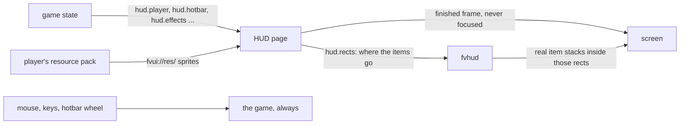

# FV-Hud

`fv-hud-0.1.0.jar` is a second mod on the same engine: hearts, hotbar, effects, boss bars, chat
and container screens are drawn by a page. It needs [FV-UI](/en/fv-ui/) and is independent of
FV-Menu in both directions, so either can be installed alone.

## What makes a HUD page different

- **It never gets input.** The HUD view is created outside any screen and stays unfocused, so a
  page can never swallow a click, a keybind or the hotbar wheel. The chat screen is the one narrow
  exception.
- **One CSS pixel is one GUI pixel.** The view is scaled by the player's GUI scale, so vanilla
  offsets go straight into the layout.
- **Resource packs apply.** Sprites come from `fvui://res/`, so whatever the player has loaded is
  what the page draws.
- **Items are drawn by the game.** The page reports rectangles through `hud.rects` and the game
  draws the real item stacks inside them.
- **It only exists in a world.** The view is created on world join and closed on leave.



## A HUD pack

The same manifest as any other pack, with `hud` in `entries`:

```json
{
  "id": "my-hud", "version": "1.0.0", "name": "My HUD", "fvui": ">=0.1.0",
  "entries": { "hud": "index.html" },
  "capabilities": ["state.sub", "state.unsub", "hud.rects"],
  "res": ["minecraft/textures/gui/sprites/hud/hotbar.png"]
}
```

Select it with `active.hud` in `<gamedir>/fvui/packs.json`. Anything the pack leaves out falls back
to the shipped HUD, and a pack with only a `theme` repaints the shipped page.

## Topics

Every one of them is lazy: a page that draws no hearts pays nothing for `hud.player`.

| topic | what |
|---|---|
| `hud.player` | health, absorption, hunger, armor, air, XP, the held item name |
| `hud.hotbar` | the nine slots, the selected one, the offhand |
| `hud.effects` | status effects with their deadlines |
| `hud.title` | title, subtitle and the action bar |
| `hud.bossbars` | boss bars, matched to their entities |
| `hud.scoreboard` | the sidebar |
| `hud.damage`, `hud.status`, `hud.reactive` | the reactive HUD, below |

<DemoHearts />

Times are absolute gui tick deadlines, not countdowns, so a page animates between pushes on its own.

## The reactive HUD

`hud.damage` carries one payload per hit with its direction and kind; `hud.status` says what
trouble the player is in: `lowHealth`, `critical`, `starving`, `drowning`, `frozen`, `onFire`,
`poisoned`, `withered` and more. The shipped page turns them into screen edges per damage kind,
cracks across the hearts, a heartbeat at critical health and bursts. The `reactive` block of
`fvui/hud.json` toggles each effect and sets the intensity.

## Beyond the hearts

| | |
|---|---|
| chat | the chat HUD and the chat screen, with the Minecraft font baked into TTF faces at runtime |
| overlays | toasts, the tab list, tooltips, the death screen |
| containers | chrome for every container screen, relayout for the inventory and chests, the creative tabs; JEI, EMI and REI get exclusion zones |
| layer editor | a transparent in-game overlay: anchors and clip rects per layer, saved to `hud.json` |

Everything above is one long reference chapter: [The HUD surface](/en/fv-hud/hud-surface).
