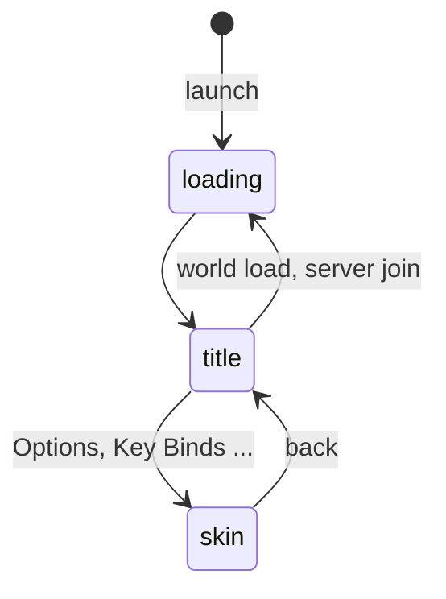
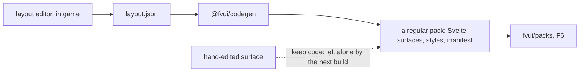

# FV-Menu

`fv-menu-0.1.0.jar` is a FancyMenu alternative built on web tech: the title screen, the screen
skins and the loading page all come from one web app. It needs [FV-UI](/en/fv-ui/) and nothing
else.

## One document, three surfaces

The menu is one WebView and one document. It does not load a page per screen, it switches modes,
and a pack declares which of them it provides under `entries` in its manifest:

| surface | what it replaces | data |
|---|---|---|
| `title` | the title screen | the `title.state`, `worlds` and `servers` topics |
| `skin` | options, key binds, pause, world creation and other vanilla screens | the screen info plus a live widget model |
| `loading` | the launch, world load and server join screens | one `loading.*` stream over five phases |

```js
fvui.on('mode', (e) => {
  // e.mode: "loading" | "title" | "skin", e.gen: a counter, e.data: per mode
  render(e.mode, e.data)
})
```



<figure>
  
  <figcaption><code>title</code>: the shipped pack. Continue, worlds and servers are topics, not scraped widgets.</figcaption>
</figure>

<figure>
  
  <figcaption><code>skin</code>: the game decides the layout. Screens it fully understands arrive as <code>flow</code> and the page lays the rows out itself; everything else arrives as <code>mirror</code> and follows the game's coordinates.</figcaption>
</figure>

<figure>
  
  <figcaption><code>loading</code>: with <code>fv-earlywindow</code> installed it is on screen from the first second of the launch.</figcaption>
</figure>

Reference: [Title, skins, flow and mirror](/en/fv-menu/surfaces) and [Loading page](/en/fv-menu/loading).

## Themes

Every shipped page reads the same CSS tokens: `--ink`, `--panel`, `--pop`, `--paper`, `--dim`,
`--glow`, `--ok`, `--bad`, `--sans`, `--mono`. A pack that is nothing but a `theme.css` repaints
the shipped screens, and three presets ship in the jar: `default`, `vanilla` and `high-contrast`.
On the title, <kbd>K</kbd> opens the pack panel.

<DemoTheme />

## The layout editor

A visual editor of `layout.json`, inside the game. The canvas mounts the same `@fvui/elements`
components a generated pack mounts, so what is on screen is the pack. `@fvui/codegen` turns the
document into a regular pack and leaves hand-edited surfaces alone.



The editor is **off unless an author turns it on** with `<gamedir>/fvui/editor.json`:

```json
{ "enabled": true }
```

An explicit `{"enabled": false}` keeps it off no matter what, which is the modpack lock.

- [Layout document](/en/fv-menu/layout-document): the format, the codegen, keep code
- [Layout editor](/en/fv-menu/editor): host and trust, panels, shortcuts
- [Code panel](/en/fv-menu/code-editor): the optional in-game code editor with the Servo lint
- [Editor plugins](/en/fv-menu/editor-plugins): `editor.plugin.js`, five hooks and no mixins

## Coming from FancyMenu

30 action ids, 188 placeholders mapped as typed bindings, visibility rules in one `visibleIf`
grammar, and events as topics. The [concept map](/en/fv-menu/fancymenu-map) says where each part
of the original lives here and what is deliberately not matched. No FancyMenu code, asset or text
is copied.

Both mods can be installed together: `coexist` in `config/fvmenu-compat.json` (`ours`, `theirs` or
`off`) decides who owns the title screen.

## Server cards

An opt-in view of the multiplayer list as pixel trading cards: the rarity comes from hours played
on that server and the accent colour from the server's own icon. <kbd>C</kbd> on the title toggles
it, the classic list is always one key away, and every failure path ends at that list.
See [Server cards](/en/fv-menu/server-cards).
