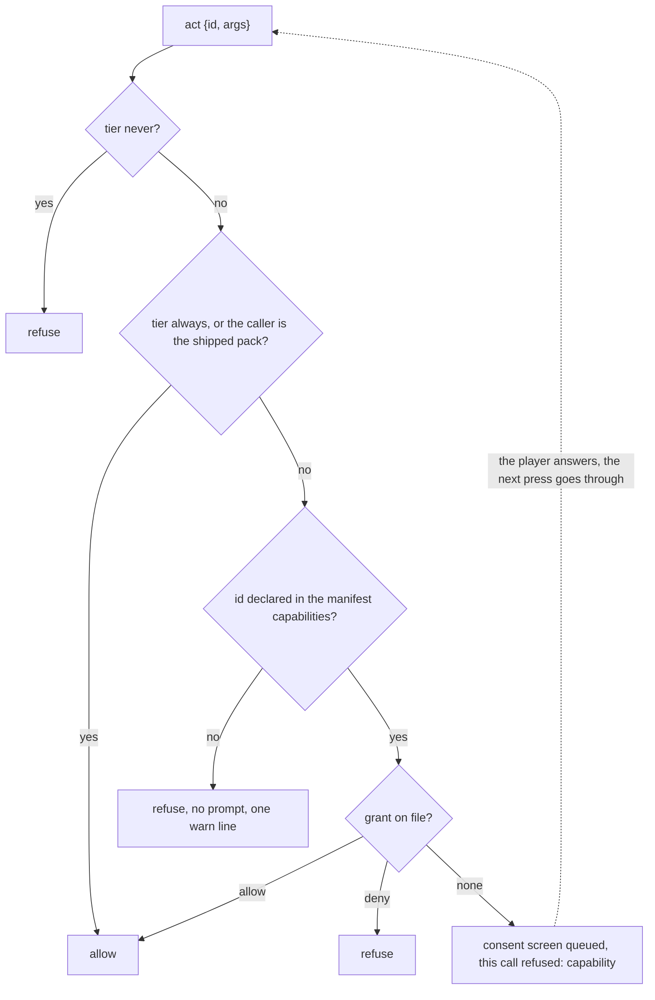

# Capabilities

The page is untrusted, Java is trusted. An ungranted call therefore fails at once and the prompt is
a vanilla screen the game draws, never a page dialog: the same document could paint a fake one.

## Tiers

| tier | ids |
|---|---|
| always | `state.sub`, `state.unsub`, `events.sub`, `events.unsub`, `open`, `skin.act`, `loading.act`, `hud.rects`, `menu.rects`, `store.get`, `store.set`, `store.remove`, `res.need`, `res.lang`, `sound.ui`, `sound.play`, `sound.stop`, `music.set`, `music.vanilla`, `server.act`, `media.probe`, `media.report`, the eight `pack.file.*` |
| ask | `quit`, `world.play`, `server.join`, `link.open`, `sound.any`, `pack.activate`, `options.write`, `game.command`, `game.chat`, `server:data`, `files` and its eight ids, `process.exec` |
| never | `files:read`, `files:write`, `net:fetch`, `net:ws` |

Always needs neither a manifest entry nor a grant. Never is always refused and a manifest listing
one fails validation. An id no tier claims is an ask, so an action a mod registers later is gated
by default; a mod can declare a tier and a description for its own ids, see [Addon mods](/en/fv-ui/addons-java).

Mods declare their own ids with their own tier and consent line, and M12 added thirty of them; the
table in [Topics and actions](/en/fv-ui/topics-actions) carries each one's tier. Ask among them: `clipboard.write`, `input.keybind`,
`resourcepacks.set`, `resourcepacks.reload`, `world.last`, `world.leave` and the four
`hud.marker.*`. `options.write` and `game.chat` are core ids and are live now: the first only
accepts the ten vanilla option names of [Topics and actions](/en/fv-ui/topics-actions) and refuses every other, the second refuses a
command, a newline and anything over 256 characters.

`link.open` and `game.command` keep both gates, the per pack grant and vanilla's own confirm screen
or command path on every call.

## Families

`files.list`, `files.read`, `files.write`, `files.append`, `files.delete`, `files.mkdir`,
`files.exists` and `files.stat` answer as one family. A manifest declares `files` once, one consent
screen names the root and the operation set, and one grant covers all eight. Declaring a single id
works too; the grant is still stored under the family. Nothing else is a family today.

## The check

In order, for every `act` call:

1. never => refuse.
2. always, or the caller is the default pack (shipped inside the jar, as trusted as the mod
   around it) => allow.
3. the id is not in the manifest `capabilities` list (or its family, or, for `process.exec`, the
   command declarations) => refuse without asking, one warn line per pack and id.
4. the grant, under the family key: allow, deny, or on a miss queue the consent screen and refuse
   this call. `process.exec` asks for itself instead, because the screen has to name the command
   line the call carries.



Step 3 is why an ask capability has to be declared. A pack that forgets it sees the call fail with
no prompt at all, and the log says so:

```txt
fvui: pack example asked for quit, which is not declared in its manifest
```

`sound.play` runs the same check a second time from inside: an id outside the UI whitelist asks for
`sound.any`. A pack's own `fvui:pack.<pack id>.<name>` sound is exempt, the same way its files and
its store are: it is the pack's own data, not the game's.

## Page side

The call fails with `{code: "capability"}` and the page keeps running. The bridge call is never
held open across a screen, so nothing times out and no promise leaks. The player answers, and the
next press goes through.

```js
const gated = (id, args) => fvui.call('act', { id, args }).catch((e) => {
  if (e.code !== 'capability') throw e;
  document.getElementById('status').textContent = 'waiting for permission: ' + id;
});

document.getElementById('quit').addEventListener('click', () => gated('quit'));
```

The `pack` topic carries `capabilities` (declared) and `granted` (allowed right now), so a page can
show its own permission state without guessing.

## The prompt

One capability of one pack per screen, with Allow, Deny and Always allow. Allow and Deny hold for
the session, Always allow writes `packs.json`, Esc is a deny. Asks queue and are drained from the
client tick, so several come one after another and an ask during mod loading waits for the first
screen.

The screen shows the pack name and id, a sentence describing the capability, and the raw id under
it. A pack cannot restyle it: `ConsentScreen` is on the never list of the skin rules.

<DemoCaps />

## Grants file

`<gamedir>/fvui/packs.json`, the same file the active pack selection lives in, written tmp plus
atomic move:

```json
{
  "active": {"menu": "example"},
  "disabled": {"crashy": "1f4a2b0c"},
  "grants": {
    "example": {"hash": "93e60c8d", "allow": ["quit"], "deny": []}
  },
  "servers": {
    "9f2a1c4d5e6b7a80": {"address": "play.example.com", "packId": "serverui",
                         "digest": "0011223344556677-1f4a2b0c", "allowed": true,
                         "authors": ["the server owner"], "license": "MIT",
                         "capabilities": ["state.sub", "server:data"]}
  },
  "trustedServers": []
}
```

`hash` is of the manifest `capabilities` list. A pack update with the same set keeps its grants, a
grown set only asks for the new entries, and a shrunk set drops the grants it no longer declares.
Grants are keyed by pack id, not by view name.

`servers` is the per server answer for a pack a server delivered, keyed by the server id and a digest
of its manifest and sorted capability list: consent there is once per server, not once per
capability. `trustedServers` is hand edited by the player and never written by the game; a server id
on it has its pack gated by grants like a local pack instead of by the server whitelist. Both are
[Servers](/en/fv-ui/server).

## Files

`pack.file.*` is the pack's own data under `fvui_data/<pack id>/files/` and is always granted, the
same rule its store and its sounds follow. `files.*` is the game folder and is an ask. Both refuse
before any prompt, as `bad-args`, when the path is absolute, holds `..` or `.`, goes through a
symlink, or is on the deny list. The caps are in [Topics and actions](/en/fv-ui/topics-actions).

The deny list of `files.*`, read and write:

| what | why |
|---|---|
| `mods/`, `config/`, `libraries/`, `versions/` | a written file there is code or configuration the next launch runs |
| `saves/`, `logs/`, `crash-reports/` | the player's worlds and reports |
| `fvui/`, `.fvui/`, `fvui_data/` | fvui's own trust decisions, caches and the other packs' data |
| `options.txt`, `optionsof.txt`, `optionsshaders.txt`, `servers.dat`, `usercache.json`, `usernamecache.json`, `launcher_profiles.json`, `realms_persistence.json`, `session.lock` | game settings and account files |
| `.jar`, `.exe`, `.dll`, `.so`, `.dylib`, `.bat`, `.cmd`, `.sh`, `.ps1`, `.msi`, `.scr`, `.com` | write only: a pack may not put code where something will run it |

Deleting, and writing over a file that is already there, ask once more the first time each happens
for a pack, naming the path. That second screen is a session answer and is never written, so a
restart asks again. The call is refused with `{code: "confirm"}` while it waits, exactly the way a
missing grant is refused: the page treats it as "not yet" and the next press goes through.

`"files": false` in `fvui/editor.json` closes the whole family with one log line. It is a modpack
setting and not something the player can grant away.

## Running a program

`process.exec` is an ask tier action, an owner decision of 2026-09-15 to be revisited at release. It
is off for a pack a server delivered at every trust level, `trustedServers` included.

A pack declares every command it may run in its manifest `capabilities` block:

```txt
"capabilities": [
  "process.exec:open-folder=xdg-open *",
  "process.exec:stamp=echo fvui-m12b *"
]
```

One entry per command: `process.exec:<name>=<program> <arg>...`. The name is `[a-z0-9-]`, up to 32
characters. A `*` argument matches one argument the page supplies, every other token has to match
itself, and the argument count is part of the match. At most 16 commands and 16 arguments each.

A call is matched against that list first. Anything it does not name is refused with `bad-args`,
logged, and never shown to the player: the consent screen only ever asks about a command the author
declared. A matched call then goes through the exec consent screen, which shows the program, its
arguments, the working directory and the whole declared list, because the answer covers the list.
The grant is stored as `process.exec@<hash of the declared list>`, so changing the list asks again.

There is no shell. The argument list goes to the process as it stands, so quoting, globbing and `;`
are not interpreted by anything. `cwd` defaults to the game directory and is resolved by the same
deny list as `files.*`. Output is capped at 64 KiB and the timeout at 60 s, 10 s by default. Every
call is logged with the pack id, the declared name and the full command line.

Three switches close it, any one of them enough:

| switch | where | default |
|---|---|---|
| `"process": false` | `fvui/editor.json`, the modpack lock | open |
| `"allowProcessExec": false` | `config/fvui-client.json`, the client policy | open, written on first launch |
| the pack declares no command | its manifest | closed |

## Media

`media.probe` and `media.report` are always granted: they carry no data of the player's, only what
the build can play and what the document's own media elements are doing. Whether anything can play
at all is `media.available`, [Servo support matrix](/en/fv-ui/servo).

## Rules of thumb for a pack

- Declare only what the page really calls. Every extra entry is one more prompt the player sees.
- Never block the UI on a gated call. Treat `capability` as "not yet" and keep rendering.
- Do not hide a needed action behind the loading screen: there is no screen to prompt on there, so
  the ask waits until the title.
- Reading is free. `state.sub`, the store, `res.need` and `res.lang` never prompt.
