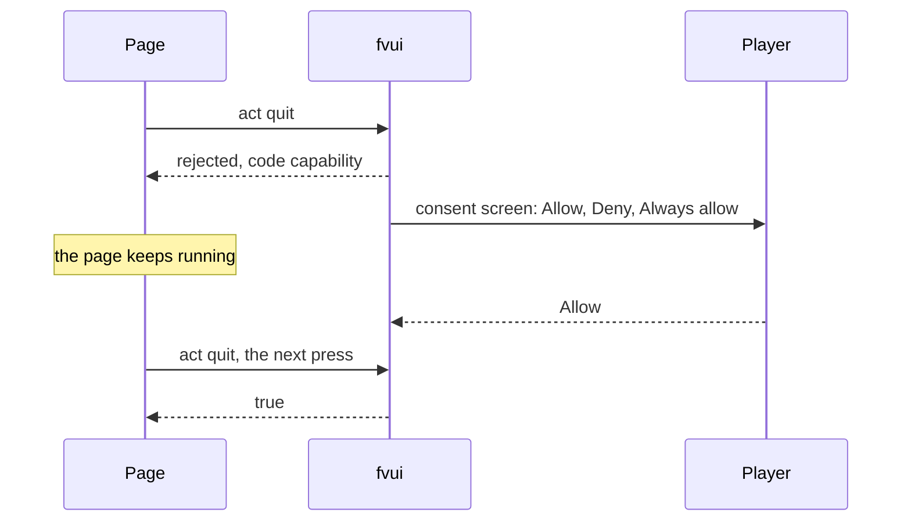

# FV-UI

`fv-ui-0.1.0.jar` is the library: Servo in the game, the bridge between a page and Java, the pack
format, the capability model and an SDK for authors. FV-Menu and FV-Hud both need it.

| part | where | what |
|---|---|---|
| `fvui-servo` | `native/` | Rust cdylib: embedded Servo 0.5, the JNI API, the `fvui://` protocol, the JS bridge |
| `fvui` | `mods/core` | NeoForge 1.21.1 mod: the native loader, `Engine`, `WebView`, `WebScreen`, `FvUiApi` |
| `@fvui/sdk` | `web/sdk` | the bridge with types, a topic cache, the pack store, theme and a browser mock, plus `@fvui/vue`, `@fvui/svelte` and `@fvui/react` |
| templates | `templates/` | pack starters for vue, svelte, react and vanilla, plus `addon-java` |

## The bridge

The game serves one script and the page loads it before anything else:

```html
<script src="fvui://bridge/bridge.js"></script>
```

```js
fvui.call(method, args)   // one bridge call, returns a Promise
fvui.on(name, cb)         // ordered events, e.g. "mode"
fvui.state(key, cb)       // a topic's value now, plus every later push
```

A bridge call is answered only for a page on `fvui://` or on an allowlisted origin.
Full reference: [Bridge](/en/fv-ui/bridge).

## Topics and actions

Game data is read as **topics**: `title.state`, `worlds`, `servers`, `options.prefs`, `pack`,
`gui.scale` and so on. A value is pushed when it changes and sampled only while a page is
subscribed, so there is nothing to poll and nothing to cache.

Everything a page does to the game goes through one call:

```js
await fvui.call('act', { id: 'open', args: { screen: 'options' } })
```

Every id with its payload: [Topics and actions](/en/fv-ui/topics-actions).

## Capabilities

The page is untrusted, Java is trusted. Consent is asked on a vanilla screen the game draws, never
in a page dialog, because the same document could paint a fake one. While the player decides, the
call fails at once with code `capability` and the page keeps running.



| tier | meaning | examples |
|---|---|---|
| <span class="tier always">always</span> | no manifest entry, no consent | `state.sub`, `open`, `skin.act`, `store.get`, `store.set`, `res.need`, `res.lang`, `sound.play`, `music.set` |
| <span class="tier ask">ask</span> | listed in the manifest, answered by the player once | `quit`, `world.play`, `server.join`, `link.open`, `pack.activate`, `options.write`, `game.command`, `files` |
| <span class="tier never">never</span> | a manifest listing one does not load | `files:read`, `files:write`, `net:fetch`, `net:ws` |

<DemoCaps />

Details, families and the grants file: [Capabilities](/en/fv-ui/capabilities).

## Packs

A pack is a folder or a zip in `<gamedir>/fvui/packs/`. The smallest complete one is three files:

```json
{
  "id": "example",
  "version": "1.0.0",
  "name": "Example Pack",
  "fvui": ">=0.1.0",
  "entries": { "title": "index.html" },
  "theme": "theme.css",
  "capabilities": ["state.sub", "open", "store.get", "store.set", "quit"]
}
```

- Whatever a pack leaves out falls back to the shipped pack, surface by surface. A pack that is
  only a `theme.css` repaints the shipped screens.
- Pack data lives in `fvui_data/<id>/store.json`, outside `config/`, so a modpack update does not
  wipe it.
- Game textures and translations come through `res.need` and `res.lang` and are served from
  `fvui://res/`, the player's resource pack applied.
- A page that throws on load disables its pack until the manifest changes, and the view falls back
  to the shipped pack.

Format reference: [Pack format](/en/fv-ui/packs). First pack: [Quick start](/en/fv-ui/quick-start).

## Templates

| template | stack | page bundle |
|---|---|---|
| `templates/vanilla` | plain ES modules, no bundler | 17 kB |
| `templates/svelte` | Svelte 5, Vite | 48 kB |
| `templates/vue` | Vue 3, Vite | 73 kB |
| `templates/react` | React 19, Vite | 232 kB |

Measured on 2026-09-14, uncompressed. Each is a complete pack: the title screen, the loading page
and a screen skin. `@fvui/*` is not on npm yet, see [JS SDK](/en/fv-ui/sdk).

## Servo is not Chromium

Servo 0.5 is a modern engine with holes in specific places, and the holes are silent: an
unimplemented property parses and does nothing.

| works | does not |
|---|---|
| CSS grid and flexbox, `:is()`, `:where()`, `&` nesting | `:has()`, `@container` |
| `@font-face`, media queries | `backdrop-filter`, `mask-image`, `text-overflow` |
| custom elements, shadow DOM, ES2022, `fetch` of `fvui://` | `user-select`, `appearance` |
| Resize, Intersection and Mutation observers, WebGL2 | grid or flex on a real `<button>` |

The rule set: [Servo support matrix](/en/fv-ui/servo).

## For Java mods and servers

`FvUiApi` lets another mod register its own topics and actions, which any pack can then read and
call: [Addon mods](/en/fv-ui/addons-java). Servers talk to packs over the `fvui:data` channel and
can deliver packs with the player's consent: [Servers](/en/fv-ui/server).
