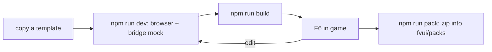

# Quick start

Four starters in `templates/`, one per stack. Each is a complete UI pack: the title screen, the
loading page and a screen skin, in about 220 lines of framework code plus one stylesheet the four
share verbatim. The build output `dist/` is the pack directory, nothing has to be assembled
around it.

| template | stack | build | page bundle |
|---|---|---|---|
| `templates/vue` | Vue 3 with `@fvui/vue` | Vite | 73 kB |
| `templates/svelte` | Svelte 5 with `@fvui/svelte` | Vite | 48 kB |
| `templates/react` | React 19 with `@fvui/react` | Vite | 232 kB |
| `templates/vanilla` | plain ES modules with `@fvui/sdk` | a copy script | 17 kB |

Measured on 2026-09-14, uncompressed. On top of them, the same in all four: 3 kB of CSS and one
latin subset of one face, 29 kB of woff2.

Nothing here is required to write a pack. The smallest complete one is `packs/example/`: a
manifest, one HTML file and a four line theme, no npm at all. Start there if your pack is one
screen. Start with a template if it is a whole menu.



## 1. Create

```sh
cp -r templates/vue ../my-pack
cd ../my-pack && npm install
```

Then change `id`, `name`, `authors` and `description` in `pack/fvui.pack.json`. The id has to match
`[a-z0-9_-]{3,64}` and the directory or zip name the pack is installed under.

The SDK packages are `file:` dependencies of the fv-ui tree while they are unpublished, see [JS SDK](/en/fv-ui/sdk). `npm run build` in `web/` has to have run once.

## 2. Dev loop in a browser

```sh
npm run dev
```

`window.fvui` only exists in the game, so `@fvui/sdk` installs its browser mock on import and the
page gets a fixture title state, worlds and servers. The game is also what sends the `mode` event,
so outside it the surface comes from the url:

```txt
http://localhost:5173/?demo=title
http://localhost:5173/?demo=loading
http://localhost:5173/?demo=skin
http://localhost:5173/?demo=skin&layout=mirror
```

`?theme=theme.css` loads the pack theme the way the game would, and `layout=` picks which of the two
skin layouts the fixture pretends to be, because the game is what decides that in a real run. The
mock logs every bridge call to the console, which is the fastest way to see the subscription
bookkeeping.

## 3. Build

```sh
npm run build
```

`publicDir: 'pack'` copies the manifest and the theme next to the built page, so `dist/` is a pack
as it stands: `fvui.pack.json`, `index.html`, `theme.css` and `assets/`. The vanilla template has
no bundler and `build.mjs` copies the same layout by hand.

`npm run typecheck` is separate: a Vite build does not type check.

## 4. Render it in the harness

The real engine, no Minecraft, one PNG. Everything with a window goes through `xvfb-run`:

```sh
cd native && cargo build --release --example headless
FVUI_PATH='index.html?demo=title&theme=theme.css' xvfb-run -a -s "-screen 0 1920x1080x24" \
  env -u WAYLAND_DISPLAY ./target/release/examples/headless \
  ../templates/vue/dist /tmp/tpl.png examples/mock 1600x900
```

Pass condition: a non empty frame and no `console` event of level error. This is where a framework
problem shows up, and it is the only cheap way to see one: [Servo support matrix](/en/fv-ui/servo) and the notes below are all
things that build fine and then render nothing.

The harness answers every action from one file, `examples/mock/act.json`, so an ask capability
resolves there instead of being refused. The consent path only exists in the game.

## 5. Run it in the dev client

From `mods/`:

```sh
xvfb-run -a -s "-screen 0 1920x1080x24" env -u WAYLAND_DISPLAY \
  ./gradlew :menu:runClient -PdevPack=templates/vue/dist -PdevOut=.work/run-tpl -PdevQuit=web
```

`-PdevPack` wins over `fvui/packs.json` and takes an absolute path or one relative to the repo
root, not to `mods/`. `-PdevOut` turns the scripted run on, `-PdevQuit=web` ends it by clicking
`.index .row.quiet` on the page, which is why every template gives its Quit row that class.

`quit` is an ask capability, so the first press raises the consent screen instead of quitting.
Answer it once by hand, or pre-allow it under `grants` in `<gamedir>/fvui/packs.json`. [Dev workflow](/en/fv-ui/dev-workflow)
has the full dev property table, [Capabilities](/en/fv-ui/capabilities) the grants file.

The skin surface is where a pack meets the widget model, and the dev run is what shows whether it
got it right. Three things the templates learned there, none of which is visible on the title or on
the Options hub:

- the game picks the layout, not the pack. Options screens it fully understands come as `flow`,
  everything else as `mirror`. A pack that only mirrors renders a flow screen at coordinates the
  game never filled in.
- in `flow` the list rows carry no usable bounds on purpose: laying them out is what the game is
  handing over. The templates stack them down the list box in payload order, offsetting each row by
  the heights before it: one list mixes heights, a category label being a third of a key bind row.
- in `mirror` a widget carrying `clip` is a row of the list with that id, so it belongs inside that
  list's box, and the list widget is a container and not a control.

Each widget's translation key goes on the element as `data-key`, the same handle the shipped pack's
flow layout uses, so a scripted run or a theme can reach one option row by name. [Surfaces](/en/fv-menu/surfaces) has the
full widget model.

While the game runs, F6 re-reads every manifest and reloads the current surface. `npm run build`
then F6 is the author loop, no restart and no second engine.

## 6. Ship it

```sh
npm run pack
```

That zips `dist/` with the manifest at the zip root. Either shape works:

```html
<gamedir>/fvui/packs/<id>.zip     extracted once per build into .fvui/cache/packs/
<gamedir>/fvui/packs/<id>/        directory pack, the name must equal the manifest id
```

[Distribution](/en/fv-ui/distribution) has the rest: what belongs in the zip, where pack data lives and what a modpack update
does to it.

## What each template is shaped by

The four render the same three surfaces from the same stylesheet, so the differences below are the
framework and nothing else. All four were built and rendered in the harness on 2026-09-14.

**Vue.** `@vitejs/plugin-vue` already dedupes `vue`, but the template sets `resolve.dedupe`
anyway: `@fvui/vue` is a `file:` dependency and resolves its own `vue` inside the SDK tree. With
two copies `getCurrentScope()` returns null inside the adapter, `onScopeDispose` never runs and no
topic is ever released. Nothing throws, the leak is only visible in the perf line.

**Svelte.** Same dedupe story, handled by the plugin. Rows are `div role="button"` because servo
ignores grid and flex on a real button, and Svelte's a11y check wants a key handler on such an
element: the template answers with a `svelte-ignore` comment and stays pointer only, like the
shipped pack. A store read with a fallback taken from a prop at init warns about
`state_referenced_locally` and only captures the first screen, so `Skin.svelte` reads
`skin.widgets` without a fallback and defaults in the markup.

**React.** `resolve.dedupe: ['react', 'react-dom']` is not optional. Without it the page ships two
copies of React and the first `useSyncExternalStore` throws `can't access property
"useSyncExternalStore", q.H is null`, on a build that compiled cleanly. Found by rendering the
build in the harness. No `StrictMode` either: it mounts every effect twice, which doubles the
`state.sub` calls and makes the perf line lie about what the pack costs. React 19 needs
`MessageChannel` and `queueMicrotask` for its scheduler; both are present in servo 0.5, and so are
`structuredClone`, `ResizeObserver` and `IntersectionObserver`.

**Vanilla.** No bundler at all. `build.mjs` copies `index.html`, `src/` and `pack/` into a flat
`dist/`, adds the `@fvui/sdk` ESM build as `sdk.js` and the two woff2 files of the font subset.
That works because the SDK bundle is one file with no imports of its own and servo runs ES
modules; an esbuild pass would buy nothing. The cost is manual: no HMR, no CSS imports from JS, no
asset hashing, and a font subset has to be added in two places. `npm run dev` rebuilds on every
page load, so an edit is one browser reload away.

## Next

- [Bridge](/en/fv-ui/bridge) and 03 for the bridge, the topics and the actions a page reads.
- [Pack format](/en/fv-ui/packs) for the manifest, `docs/dk/fvui.pack.schema.json` for a machine readable copy of it.
- [Servo support matrix](/en/fv-ui/servo) before picking a component library. The templates ship none on purpose.
- [JS SDK](/en/fv-ui/sdk) for the SDK API the templates use.
- [Addon mods](/en/fv-ui/addons-java) and `templates/addon-java/` if the data your pack wants does not exist yet.
