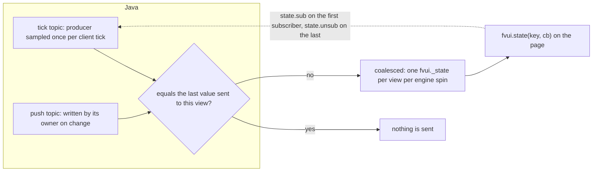

# Topics and actions

Game data is read as topics, game work is done through actions. Both are registered by mods, and
fvui never names the mod that registered them.

## Topics

Two kinds. A tick topic has a producer sampled once per client tick while at least one page is
subscribed, and starts and stops with the first and last subscriber. A push topic is written by
whoever owns the data, whenever it changes. Either way the page sees the same thing:

```js
fvui.call('state.sub', { topics: ['title.state', 'gui.scale'] });
fvui.state('title.state', (state) => console.log(state.player, state.splash));
```



Values are diffed with `equals` on the Java side, so an unchanged value costs nothing. Tick topics
do not run during mod loading, because the game event bus is not started yet: anything the loading
page needs is pushed, see [Loading page](/en/fv-menu/loading).

| topic | owner | kind | payload |
|---|---|---|---|
| `screen.id` | core | tick | class name of the current screen, or null |
| `server.channel` | core | push | `{protocol, topics, actions, rateLimit, sizeCap}` while a server carries `fvui:data`, else null |
| `server.data.motd` | core | tick | the message the server shows. [Servers](/en/fv-ui/server) |
| `server.data.players` | core | tick | player names on the server, sorted |
| `server.data.tick` | core | tick | `{count, ms}` of the server clock |
| `gui.scale` | core | tick | `{guiScale, auto, cssScale, width, height}` |
| `dev.perf` | core | push | `{evals, bytes, keys, flushes, calls, blocked, pending}`, once a second |
| `res.epoch` | core | push | integer, bumped by a resource reload |
| `font.epoch` | core | push | integer, bumped by a resource reload, see [The HUD surface](/en/fv-hud/hud-surface) |
| `pack` | core | push | the active pack, see the shape below |
| `packs` | core | push | list of every pack found, valid and broken |
| `options.prefs` | fvmenu | tick | `{blur, speed, splash, contrast}` |
| `theme` | fvmenu | tick | `{preset, vars}`, preset is `default`, `high-contrast` or `vanilla` |
| `title.state` | fvmenu | push | pushed whenever the title is shown |
| `worlds` | fvmenu | push | pushed with `title.state` |
| `player.skin` | core | push | pushed with `title.state` and again once the download lands |
| `servers` | fvmenu | push | whole list per ping answer |
| `servers.stats` | fvmenu | push | hours, joins and a note per server, pushed on a refresh, a leave and a note write |
| `loading.info` | fvmenu | push | once per loading phase, [Loading page](/en/fv-menu/loading) |
| `loading.progress` | fvmenu | push | every 100 ms in boot, per render frame in the other phases |
| `server.address` | fvmenu | tick | `{address, name, lan, singleplayer}`, null in singleplayer |
| `mods.loaded` | fvmenu | tick | sorted list of the installed mod ids |
| `skin.widgets` | fvmenu | push | per render frame of a skinned screen, diffed |
| `hud.player` | fvhud | tick | health, food, armor, air, xp and the held item name, [The HUD surface](/en/fv-hud/hud-surface) |
| `hud.hotbar` | fvhud | tick | the nine slots, the offhand and the selected index |
| `hud.effects` | fvhud | tick | active effects with an absolute end tick |
| `hud.title` | fvhud | tick | title, subtitle and action bar with their deadlines |
| `hud.bossbars` | fvhud | tick | one entry per visible boss bar, plus the matched entity, [The HUD surface](/en/fv-hud/hud-surface) |
| `hud.damage` | fvhud | tick | one payload per hit: bearing, ramp deadline, amount and damage type, [The HUD surface](/en/fv-hud/hud-surface) |
| `hud.status` | fvhud | tick | the trouble the player is in, on vanilla's own thresholds, [The HUD surface](/en/fv-hud/hud-surface) |
| `hud.reactive` | fvhud | tick | the `reactive` block of `fvui/hud.json`: which effects the HUD page runs |
| `hud.scoreboard` | fvhud | tick | the sidebar objective, or null |
| `hud.tablist` | fvhud | tick | the whole roster with its columns, heads and ping, [The HUD surface](/en/fv-hud/hud-surface) |
| `hud.chat` | fvhud | tick | the backlog ring, live lines are the `hud.chat.line` event |
| `hud.chat.opts` | fvhud | tick | the vanilla chat options, every number already computed |
| `chat.suggest` | fvhud | push | the command suggestion popup while the chat screen is open, [The HUD surface](/en/fv-hud/hud-surface) |
| `hud.tooltip` | fvhud | push | the tooltip the game would have drawn, already positioned |
| `hud.toasts` | fvhud | tick | the live toasts, in **wall clock milliseconds** |
| `screen.death` | fvmenu | tick | the cause, the score and the gradient of the death screen |
| `hud.layers` | fvhud | tick | every GUI layer seen render, with its rule |
| `hud.container` | fvhud | push | the open container screen: image rect, slots, labels, buttons, [The HUD surface](/en/fv-hud/hud-surface) |
| `media.available` | core | push | `{native, probed, types, ok}`, whether this build plays media at all |
| `media.state` | core | push | per element `{playing, paused, position, duration, volume, src, frame}` |
| `item.epoch` | core | push | bumped on a resource reload, re-ask `item.icons` for fresh URLs |
| `world.time` | fvhud | tick | day time, day, rain and thunder |

The fifteen topics M12 added, which is what the 92 loading requirement families and about 90 of the
placeholders of the original read. All lazy like every other producer: a page that asks for none of
them costs nothing.

| topic | owner | kind | payload |
|---|---|---|---|
| `screen.title` | core | tick | the title of the open screen, or null |
| `window.fullscreen` | core | tick | boolean |
| `screen.hover` | core | tick | `{widget, item, slot}`, what the pointer is over |
| `input.keys` | core | tick | held key names, e.g. `key.keyboard.left.shift` |
| `sys` | core | tick | `{os, arch, java, jvm, cpu, gl, gpu, maxMemory}`, sampled once |
| `res.packs` | core | tick | enabled resource pack ids, in apply order |
| `world.session` | fvmenu | tick | `{loaded, singleplayer, multiplayer, hardcore, difficulty, saveName, dimension}` |
| `server.ping` | fvmenu | tick | the saved server list keyed by address |
| `player.gamemode` | fvhud | tick | `survival`, `creative`, `adventure` or `spectator` |
| `player.pos` | fvhud | tick | `{x, y, z, blockX, blockY, blockZ, yaw, pitch, facing, dim, biome, light, structure}` |
| `player.state` | fvhud | tick | 21 booleans and numbers: sneaking, running, elytra, frozen, attackStrength, ... |
| `player.inventory` | fvhud | tick | `{selected, size, held, slots}`, only the slots that hold something |
| `player.permission` | fvhud | tick | 0 to 4 |
| `world.weather` | fvhud | tick | `{raining, snowing, thundering, clear, difficulty, hardcore}` |
| `world.entities` | fvhud | tick | entities within 24 blocks, `{id, name, distance, yaw}`, nearest first |
| `hud.markers` | fvhud | tick | the compass waypoints `hud.marker.*` writes |

The `structure` field of `player.pos` is always null and `world.session` carries no seed: both are
server knowledge, and a client that guessed them would be lying. The `gpu` and `gl` fields of `sys`
are the two GL strings, read once per launch.

Payload shapes, field by field.

`gui.scale`: `guiScale` is the player's setting, `auto` what the window would pick, `cssScale` the
CSS pixel scale the view is created with, `width` and `height` the framebuffer in device pixels,
`guiWidth` and `guiHeight` vanilla's own canvas, which is the box a HUD page lays out in.
`cssScale` is `clamp(height / 900, 1, 4) * sqrt(clamp(guiScale / auto, 0.1, 1))`.

`options.prefs`: `blur` is menu background blurriness 0 to 10, `speed` the panorama speed,
`splash` false when splash texts are hidden, `contrast` the High Contrast option. The same four
also ride the page URL as `blur`, `speed`, `splash` and `contrast`, because the first loading frame
exists before any client tick.

`title.state`:

```json
{
  "player": "Dev", "minecraft": "1.21.1", "neoforge": "21.1.250", "mods": 4,
  "splash": "Kiss the sky!", "demo": false, "multiplayerAllowed": true,
  "language": "English",
  "branding": ["Minecraft 1.21.1", "NeoForge 21.1.250"],
  "labels": {"menu.singleplayer": "Singleplayer", "menu.quit": "Quit Game"}
}
```

`labels` carries the game translation of `menu.singleplayer`, `menu.multiplayer`, `menu.online`,
`menu.options`, `menu.quit`, `fml.menu.mods`, `selectWorld.title`, `selectWorld.create` and
`options.accessibility.title`. Anything else comes from `res.lang`. `splash` may be null.

`worlds`: one entry per save, `{id, name, lastPlayed, mode, hardcore, cheats, version, locked,
playable, broken}` plus `icon` when the save has one, as `fvui://saves/<url encoded id>/icon.png?t=<last
played>`. A corrupted or symlinked save has `broken: true` and a null `mode` and `version`: the game
carries no settings for one, so only `id`, `name`, `lastPlayed` and `icon` are real.

`player.skin`: `{url, slim, name, secure}`. `url` is a PNG on `fvui://res/` for a bundled default
skin and on `fvui://worlds/skin/` for a downloaded one, and is null while neither could be produced.
`slim` is the mesh the skin asks for and is the only thing a page may branch the model on: the
default texture is a slim one whatever the name says. Mob textures are plain resources, so
`res.need` with `minecraft/textures/entity/creeper/creeper.png` and friends is the whole story.

`servers`: `{index, name, ip, address, state, ping, motd, motdHtml, motdRuns, version}` plus `online`
and `max` once the ping answered, plus `icon`, `accent` and `accent2` once an icon is known. `state`
is `initial`, `pinging`, `successful`, `incompatible` or `unreachable`, lower case. `index` is what
`server.join` takes.

`address` is the normalized `host:port`, the join key between this list and `servers.stats`; `ip` is
still the raw string the player typed. `icon` is a `fvui://servericon/<key>.png?v=<epoch>` url, where
the key is a hash of the icon bytes, so two servers with the same icon share one file; it was a
`data:` url before M15 and both are valid `img` sources. `accent` and `accent2` are `#rrggbb`
quantised out of that icon once per distinct key, and are absent when the server has no icon.
`motdHtml` is the `ComponentHtml` row of [The HUD surface](/en/fv-hud/hud-surface), for a DOM list; `motdRuns` is
`[[["text", "gold"], ["text", null]], ...]`, at most two source lines of `(text, colour)` pairs for a
canvas painter, the colour being the name for a named one and `#rrggbb` for a hex one.

`servers.stats`: `{"<address>": {hours, joins, last, note, tier}}`, keyed by the same normalized
address because a `servers.dat` index moves when the player reorders the list. `hours` is wall clock
time on that server counted by the client and rounded to one decimal, `last` the epoch millis of the
last join, `tier` one of `common`, `uncommon`, `rare`, `epic`, `legendary` off the hours. It lives in
`fvui/stats.json` in the game directory, never in `servers.dat`, which drops unknown keys.

`pack` and one entry of `packs`:

```json
{
  "id": "example", "name": "Example Pack", "version": "1.0.0", "authors": ["fatevis"],
  "source": "dir", "valid": true, "active": true, "disabled": false,
  "capabilities": ["quit"], "granted": []
}
```

`source` is `jar`, `dir`, `zip` or `dev`. `capabilities` is what the manifest declared, `granted`
what the player allowed. A pack that failed validation is listed as
`{id, valid: false, active: false, error: "<first problem>"}` and has no other field, which is what
a picker shows as broken.

`dev.perf` is only sampled while a page subscribes to it or `-Dfvui.dev.perf` is set. `calls` and
`blocked` are per second, `pending` is the current backlog.

`loading.info`, `loading.progress` and `skin.widgets`: [Loading page](/en/fv-menu/loading) and [Surfaces](/en/fv-menu/surfaces).

`server.address` is what a pack branches on to show a row only on one server, the way a FancyMenu
layout uses its server IP requirement; it follows `Minecraft.getCurrentServer()`, so a local world
opened to LAN has one and a plain singleplayer world has none. `mods.loaded` is the same thing for
"is this mod installed".

## Actions

One bridge method carries all of them:

```js
const act = (id, args) => fvui.call('act', { id, args });
await act('open', { screen: 'options' });
```

Every action is checked against the capability tiers of [Capabilities](/en/fv-ui/capabilities) before it runs.

| action | args | result | tier |
|---|---|---|---|
| `open` | `{screen}` | `true` | always |
| `server.act` | `{id, args}` | `{seq}`, answered on the `server.reply` event | always, and `server:data` inside it |
| `quit` | none | `true` | ask |
| `world.play` | `{id}` | `true`, or `false` when the world cannot be opened | ask |
| `server.join` | `{index}` | `true`, or `false` for an unknown index | ask |
| `servers.refresh` | none | `true` | always |
| `servers.note.set` | `{address, text}`, trimmed and clipped to 240 | `{address, note}`, an empty text removing it | always |
| `servers.note.get` | `{address}` | `{address, note}` | always |
| `store.get` | `{key}` or none | the value, or `{version, data}` without a key | always |
| `store.set` | `{key, value}` | `true` | always |
| `store.remove` | `{key}` | `true` | always |
| `res.need` | `{paths}` | `{epoch, urls}` | always |
| `item.icons` | `{items: [{id, count, components}]}` | `{epoch, urls}` | always |
| `player.skin` | none | `{url, slim, name, secure}` | always |
| `hud.rects` | `{epoch, cssScale, rects, bars}` | `true` | always, HUD view only |
| `container.rects` | `{epoch, cssScale, rects, occluders, interactive}` | `true` | always, container view only |
| `container.act` | `{action}`: `close`, `recipebook`, `focus`, `tab`, `scroll`, `search` | `true`, `false` for an unknown action | always |
| `res.lang` | `{keys}` or `{prefix}` | object of key to translated text | always |
| `sound.play` | `{id, volume, pitch, category}` | `true` | always for UI ids, `sound.any` otherwise |
| `sound.stop` | `{id}` or none | `true` | always |
| `music.set` | `{id, loop, fade}` | `true` | always |
| `pack.activate` | `{id}` | `true` | ask |
| `link.open` | `{url}` | `true` once the player answered | ask |
| `game.command` | `{command}` | `true`, or `false` for an empty, overlong or multiline one | ask |
| `font.need` | `{fonts}` | `{epoch, fonts: {id: {faces, sidecar, glyphs}}}` | always |
| `text.rects` | `{rects: [{token, index, x, y, w, h}]}` | `true` | always |
| `text.click` | `{token, index, x, y, button, shift}` | `true`, or `false` for an action refused outside its screen | ask |
| `text.insert` | `{token, index}` | `true` when the style carries an insertion | always |
| `text.hover` | `{token, index}` | `{kind: "text", html}`, `{kind: "native"}` or `{kind: "none"}` | always |
| `chat.scroll` | `{lines}` | `true` | always, HUD view only |
| `hud.reactive.set` | `{fx, value}`, or `{enabled}`, or `{intensity}` | the whole `hud.reactive` payload | ask |

The thirty ids M12 added, which closes the action inventory of the original except the families that
wait on M11. Grouped the way that inventory groups them.

| family | action | args | tier | owner |
|---|---|---|---|---|
| screen | `screen.close` | none | always | fvmenu |
| screen | `screen.back` | none | always | fvmenu |
| screen | `screen.reload` | none | always | fvmenu |
| level | `world.last` | none | ask | fvmenu |
| level | `world.leave` | none | ask | fvmenu |
| game | `game.chat` | `{message}` | ask | fvmenu |
| game | `chat.show` | `{text}` | always | core |
| game | `chat.paste` | `{text}` | always | core |
| game | `clipboard.write` | `{text}` | ask | core |
| game | `log.write` | `{text}` | always | core |
| game | `input.keybind` | `{key}`, the bind's translation key | ask | core |
| client | `toast.show` | `{title, text}` | always | core |
| client | `resourcepacks.set` | `{id, enabled}` | ask | core |
| client | `resourcepacks.reload` | none | ask | core |
| client | `pack.reload` | none | always | core |
| client | `options.read` | none | always | core |
| client | `options.write` | `{name, value}` | ask | core |
| client | `ui.set` | `{id, value}` | always | page |
| audio | `music.next` | `{id}` | always | page |
| audio | `music.prev` | `{id}` | always | page |
| audio | `music.toggle` | `{id}` | always | page |
| audio | `music.volume` | `{id, volume}` | always | page |
| animation | `anim.set` | `{id, state}` | always | page |
| animation | `anim.reset` | `{id}` | always | page |
| scheduler | `sched.start` | `{id}` | always | page |
| scheduler | `sched.stop` | `{id}` | always | page |
| markers | `hud.marker.add` | `{id, label, x, y, z, color}` | ask | fvhud |
| markers | `hud.marker.set` | the same | ask | fvhud |
| markers | `hud.marker.remove` | `{id}` | ask | fvhud |
| markers | `hud.marker.clear` | none | ask | fvhud |
| media | `media.play` | `{id}` | always | page |
| media | `media.pause` | `{id}` | always | page |
| media | `media.seek` | `{id, time}` in seconds | always | page |
| media | `media.volume` | `{id, volume}` | always | page |
| media | `media.probe` | `{types}` the page can play | always | core |
| media | `media.report` | `{id, state}`, or `{id, gone}` | always | core |
| audio | `music.vanilla` | `{menu, world}` | always | core |
| pack files | `pack.file.list` | `{path, deep}` | always | core |
| pack files | `pack.file.read` | `{path, base64}` | always | core |
| pack files | `pack.file.write` | `{path, text}` or `{path, base64}` | always | core |
| pack files | `pack.file.append` | the same | always | core |
| pack files | `pack.file.delete` | `{path}` | always | core |
| pack files | `pack.file.mkdir` | `{path}` | always | core |
| pack files | `pack.file.exists` | `{path}` | always | core |
| pack files | `pack.file.stat` | `{path}` | always | core |
| game files | `files.list` | `{path, deep}` | ask, family `files` | core |
| game files | `files.read` | `{path, base64}` | ask, family `files` | core |
| game files | `files.write` | `{path, text}` or `{path, base64}` | ask, family `files` | core |
| game files | `files.append` | the same | ask, family `files` | core |
| game files | `files.delete` | `{path}` | ask, family `files` | core |
| game files | `files.mkdir` | `{path}` | ask, family `files` | core |
| game files | `files.exists` | `{path}` | ask, family `files` | core |
| game files | `files.stat` | `{path}` | ask, family `files` | core |
| process | `process.exec` | `{cmd, args, cwd, timeout}` | ask, declared per command | core |

Owner `page` means the document owns the thing the call names - an animator, a repeating script, a
field, a playlist - so the host registers the id for the catalogue and the tier, and the handler
hands the call straight back to the calling view as the ordered `page.act` event. One path, whether
the call came from the document or from another mod.

`options.write` is the global customizations of the original. It accepts `guiScale`, `fullscreen`,
`fov`, `gamma`, `renderDistance`, `musicVolume`, `masterVolume`, `hideGui`, `bobView` and `autoJump`
and refuses every other name rather than reflecting onto it. A layout sets them declaratively with
its `options` block ([Layout document](/en/fv-menu/layout-document)), which the generator turns into one call per option on mount.

`input.keybind` takes the translation key of a bind the player owns, e.g. `key.jump`. It presses
that bind, so a pack drives a feature of a mod it knows nothing about.

`world.last` opens the newest playable save of the list the title already loaded, so it never blocks
a frame on the level source.

## Files, a program, and media (M12b)

Two file families, both rooted and neither able to leave its root. `pack.file.*` is the pack's own
data under `fvui_data/<pack id>/files/`, always granted exactly as its store is, capped at 4 MiB a
file, 32 MiB and 512 files a pack. `files.*` is the game folder behind one ask grant for the whole
family, capped at 8 MiB a file, with a deny list and one more confirm the first time a destructive
call runs. [Capabilities](/en/fv-ui/capabilities) has the rules; the shapes are the same for both:

```js
await fvui.call('act', { id: 'pack.file.write', args: { path: 'notes/a.txt', text: 'one' } });
const back = await fvui.call('act', { id: 'pack.file.read', args: { path: 'notes/a.txt' } });
// back.text === 'one'. A read answers {base64} instead when the call passes base64: true
```

Every write is a temp file plus an atomic move, `append` included, so a half written file is never
what the game reads back. `delete` takes a file or an empty directory. `list` answers
`{files: [{path, size, dir, mtime}]}`, one level deep unless `deep` is set.

`process.exec {cmd, args, cwd, timeout}` runs one program with no shell and answers
`{ok, code, timedOut, out}`; output is capped at 64 KiB and the timeout at 60 s, default 10 s. The
pack declares every command it may run in its manifest, [Capabilities](/en/fv-ui/capabilities), and a call that matches none of
them is refused with `bad-args` and no prompt at all.

`media.*` drive a `video` or `audio` element of the running document by its element id, the way
`music.*` drive an audio playlist. `media.probe` is how the page tells the game what this build can
play, and `media.report` is how a media element publishes its state into `media.state`, which is
what the thirteen media bindings of [Layout editor](/en/fv-menu/editor) read. `music.vanilla {menu, world}` is the music
controller: false turns vanilla's own menu or world music off while the pack is up.

## Events

A topic is last-value-wins and coalesced; an **event** is every occurrence, in order. That is what a
script hanging off "the player took damage" needs, and it is the listener half of the original's
inventory.

```js
await fvui.call('events.sub', { events: ['player.damage'] });
fvui.on('player.damage', (payload) => console.log(payload.amount));
```

`events.sub` and `events.unsub` are bridge methods, not action ids, and both are always granted:
they only decide what this view is told about. From the SDK it is one call, with the refcount and
the topic pairing already done:

```js
import { listen } from '@fvui/sdk'
const off = listen('player.damage', (payload) => { ... })
```

| event | owner | payload |
|---|---|---|
| `player.damage` | fvhud | `{amount, health, max}` |
| `server.reply` | core | `{seq, ok, result}` for a `server.act` call |
| `player.death` | fvhud | `{health}` |
| `player.respawn` | fvhud | `{player}` |
| `player.levelup` | fvhud | `{level, from}` |
| `world.join` | fvhud | `{player}` |
| `world.leave` | fvhud | `{}` |
| `screen.open` | core | `{screen}` |
| `screen.close` | core | `{screen}` |
| `key.press` | core | `{key, modifiers}` |
| `page.act` | core | `{id, args}`, the page owned actions above |
| `topic:<id>` | core | the new value, whenever that topic changes |

`topic:<id>` is the generic family and it is why 85 listener types need no 85 channels: every topic
is already an event. `listen('topic:hud.player', ...)` also subscribes `hud.player`, because a topic
with no subscriber has no producer running to change.

Nothing is queued. An event fired while no page listens is gone, exactly as a game event is. A hook
that costs something - a game bus listener, a poll - is only registered once somebody listens, the
same lazy rule every producer follows.

`open` screens: `singleplayer`, `multiplayer`, `realms`, `options`, `language`, `accessibility`,
`mods`, `create-world`, `add-server`, `edit-server` and `classic` (one vanilla title screen, the way
back out of a pack). An unknown name throws with code `error`.

`edit-server` takes `index` as well, the row of the `servers` topic to edit, and opens the vanilla
`EditServerScreen` over it; without an index, and for `add-server`, it opens on a fresh entry. The
saved list is written by the vanilla screen and the pings are refreshed on the way back. Removing a
server stays in `multiplayer`: `servers.dat` belongs to the vanilla list.

`sound.play` ids always allowed: `minecraft:ui.button.click`, `ui.toast.in`, `ui.toast.out`,
`ui.stonecutter.select_recipe`, `ui.loom.select_pattern`, plus the pack's own
`fvui:pack.<pack id>.<name>` sounds. Anything else needs the `sound.any` grant. `volume` is clamped
to 0..1, `pitch` to 0.5..2, `category` is a sound source name (`master`, `music`, `record`, ...),
and only ids in the loaded `sounds.json` are accepted, the pack sounds of [Pack format](/en/fv-ui/packs) included.

`music.set` holds one instance tied to no screen, so the same id sent again while it plays is
ignored and the music carries from the title into Options and back. `{"id": null}` stops it,
`fade` is milliseconds.

`res.need` and `res.lang`: [Pack format](/en/fv-ui/packs). `store.*`: [Pack format](/en/fv-ui/packs). `pack.activate`: [Pack format](/en/fv-ui/packs).

`game.command` runs as the player: a leading `/` is stripped, newlines are refused and anything
over 256 characters is too.

### Clicking a rendered component

A page never receives the URL, the command or the insertion behind a chat span. It receives a
`token` and an index into a table Java built from a component **the game itself received**, which
is what the `data-k="<token>:<n>"` attribute of [The HUD surface](/en/fv-hud/hud-surface) carries. So a pack page cannot
synthesise a `run_command` click that no server ever sent.

Two more gates on `text.click`: a screen must be open, and the pointer in the call must be inside
the rect the page last published for that entry through `text.rects`. Without both it is refused
with code `bad-args`. `open_url` goes through the same confirm screen `link.open` uses,
`copy_to_clipboard` through the game's clipboard, `run_command` and `suggest_command` through
`Screen.handleComponentClicked`; `change_page` and `open_file` are refused, as vanilla refuses a
server's `open_file` too.

`text.hover` answers `{kind: "native"}` for `show_item` and `show_entity`, which need item and
entity rendering and belong in an island, not in HTML. `text.insert` writes straight into the open
screen's field, without the shift vanilla asks for in chat, because a page offering a button of its
own has no modifier to hold. The chat screen is the one place that still wants that modifier: the
HUD page calls `text.insert` on a shift click and falls back to `text.click`, which is the branch
`Screen.handleComponentClicked` takes for itself.

Every deadline in these payloads is an absolute gui tick, with **one exception**: `hud.toasts` is in
`Util.getMillis()` wall clock milliseconds, because a toast keeps running while the game is paused.
It carries its own `now`, so a page never mixes the two clocks.

`font.need`: [The HUD surface](/en/fv-hud/hud-surface), the chat and font section.

`skin.act` and `loading.act` are bridge methods of their own, not action ids, see [Surfaces](/en/fv-menu/surfaces) and
[Loading page](/en/fv-menu/loading); so is `menu.rects`, the island batch of the menu view.

## Registering your own

From the constructor of any client mod:

```java
FvUiApi.topic("example.counter", () => ticks);
FvUiApi.push("example.pings", 0);
FvUiApi.action("example.read", args -> ticks, Capabilities.Tier.ALWAYS, "Read the example counter");
```

[Addon mods](/en/fv-ui/addons-java) has the whole story, including what a producer may and may not do inside a tick.
