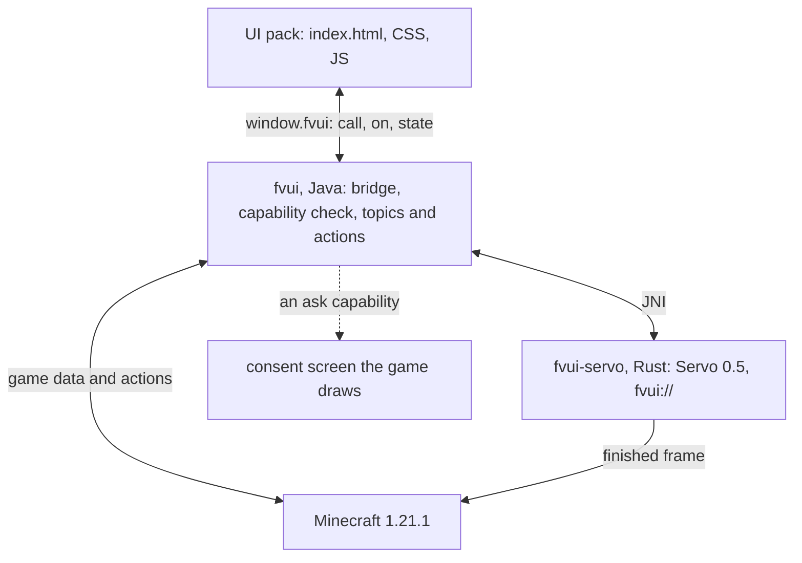
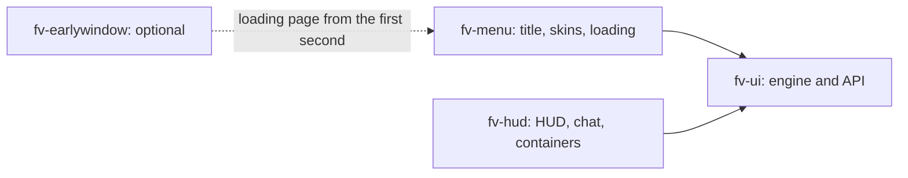

# What is FateVis

FateVis runs the [Servo](https://servo.org) browser engine inside Minecraft. The menu, the loading
screen and the HUD become an ordinary web page.

Changing the interface takes no Java: HTML, CSS and JS, with Vue, Svelte, React or no framework at
all. The game hands the page its data and takes actions back through one object, `window.fvui`.

## Three mods

| mod | jar | what it is |
|---|---|---|
| [FV-UI](/en/fv-ui/) | `fv-ui` | the engine and the API: Servo, the bridge, packs, capabilities, the SDK |
| [FV-Menu](/en/fv-menu/) | `fv-menu` | a FancyMenu alternative: title screen, screen skins, loading page, layout editor |
| [FV-Hud](/en/fv-hud/) | `fv-hud` | the in-world HUD, chat, toasts, tab list and container screens |

FV-Menu and FV-Hud are built on FV-UI and do not depend on each other, so either one can be
installed alone. A fourth, optional jar, `fv-earlywindow`, puts the loading page on screen from
the first second of the launch.

## How the pieces fit

Two things can be built on it:

- **a UI pack**: HTML, CSS and JS replacing the title screen, the loading page, the screen skins
  or the HUD. No Java, no build step required. Start at the [quick start](/en/fv-ui/quick-start).
- **an addon mod**: Java registering game data and game actions that any pack can read and call.
  Start at [Addon mods](/en/fv-ui/addons-java).

Both talk through one bridge object and one capability model.

## What it looks like

<figure>
  
  <figcaption>The shipped pack's title screen. Worlds, servers and the splash are the <code>worlds</code>, <code>servers</code> and <code>title.state</code> topics.</figcaption>
</figure>

<figure>
  
  <figcaption>A screen skin: vanilla options arrive as a widget model and the page lays them out.</figcaption>
</figure>

Captured from the shipped pack in demo mode (`?demo=title`, `?demo=video`); the data is fixture data.

## Rules of the house

- The page is untrusted, Java is trusted. Anything reaching the player or the world outside the
  page is a [capability](/en/fv-ui/capabilities) the game asks about, on a screen the game draws.
- One active pack per view. The menu is one document that switches modes, not one page per screen.
- Servo 0.5 is not Chromium. Read the [support matrix](/en/fv-ui/servo) before picking a framework
  or a component library.
- Game data is read as topics, never scraped: a topic is sampled only while a page is subscribed.
- A pack a server delivered is never trusted. It gets a fixed whitelist, one consent per server,
  and no way at all to reach your files or run commands as you.

## Versions

| what | value |
|---|---|
| FateVis | 0.1.0 |
| Minecraft | 1.21.1 |
| NeoForge | 21.1.250 (range `[21.1,)`) |
| Java | 21 |
| Servo | 0.5.0 |
| bridge API | the same 0.1.0, a pack declares its range in the manifest `fvui` field |

One version number covers the mod, the manifest range and the addon dependency. A pack that works
on 0.1.0 declares `"fvui": ">=0.1.0"`.
