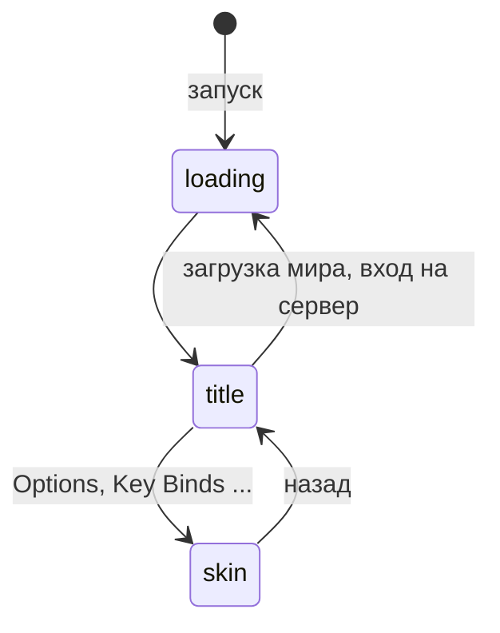
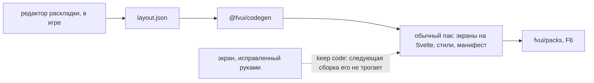

# FV-Menu

`fv-menu-0.1.0.jar` — альтернатива FancyMenu на веб-технологиях: титульный экран, скины экранов и
страница загрузки приходят из одного веб-приложения. Нужен только [FV-UI](/ru/fv-ui/).

## Один документ, три экрана

Меню — это один WebView и один документ. Он не загружает страницу на каждый экран, а переключает
режимы. Какие из них даёт пак, указано в `entries` его манифеста:

| экран | что заменяет | данные |
|---|---|---|
| `title` | титульный экран | темы `title.state`, `worlds` и `servers` |
| `skin` | настройки, управление, паузу, создание мира и другие ванильные экраны | сведения об экране и живая модель виджетов |
| `loading` | экраны запуска, загрузки мира и входа на сервер | один поток `loading.*` на пять фаз |

```js
fvui.on('mode', (e) => {
  // e.mode: "loading" | "title" | "skin", e.gen: счётчик, e.data: свои для каждого режима
  render(e.mode, e.data)
})
```



<figure>
  
  <figcaption><code>title</code>: штатный пак. «Продолжить», миры и серверы — это темы, а не выскобленные виджеты.</figcaption>
</figure>

<figure>
  
  <figcaption><code>skin</code>: раскладку выбирает игра. Экраны, которые она понимает целиком, приходят как <code>flow</code>, и страница раскладывает строки сама; остальные приходят как <code>mirror</code> и повторяют координаты игры.</figcaption>
</figure>

<figure>
  
  <figcaption><code>loading</code>: с установленным <code>fv-earlywindow</code> она на экране с первой секунды запуска.</figcaption>
</figure>

Справка: [Титул, скины, flow и mirror](/ru/fv-menu/surfaces) и [Страница загрузки](/ru/fv-menu/loading).

## Темы

Все штатные страницы читают одни и те же CSS-токены: `--ink`, `--panel`, `--pop`, `--paper`,
`--dim`, `--glow`, `--ok`, `--bad`, `--sans`, `--mono`. Пак из одного `theme.css` перекрашивает
штатные экраны, а в jar лежат три пресета: `default`, `vanilla` и `high-contrast`. На титульном
экране <kbd>K</kbd> открывает панель пака.

<DemoTheme />

## Редактор

Визуальный редактор `layout.json` прямо в игре. Холст монтирует те же компоненты `@fvui/elements`,
что и готовый пак, так что на экране — именно пак. `@fvui/codegen` превращает документ в обычный
пак и не трогает экраны, код которых правили руками.



Редактор **выключен, пока автор его не включит** файлом `<gamedir>/fvui/editor.json`:

```json
{ "enabled": true }
```

Явное `{"enabled": false}` держит его выключенным при любых условиях — это замок для модпака.

- [Документ раскладки](/ru/fv-menu/layout-document): формат, codegen, keep code
- [Редактор раскладки](/ru/fv-menu/editor): хост и доверие, панели, горячие клавиши
- [Панель кода](/ru/fv-menu/code-editor): необязательный редактор кода в игре с линтером Servo
- [Плагины редактора](/ru/fv-menu/editor-plugins): `editor.plugin.js`, пять хуков и ни одного миксина

Все четыре главы пока на английском.

## Если вы с FancyMenu

30 действий, 188 плейсхолдеров в виде типизированных привязок, условия показа одной грамматикой
`visibleIf`, события как темы. [Если вы с FancyMenu](/ru/fv-menu/fancymenu-map) говорит, где
здесь живёт каждая часть оригинала и что намеренно не повторено. Код, ассеты и тексты FancyMenu
не копировались.

Оба мода можно поставить вместе: `coexist` в `config/fvmenu-compat.json` (`ours`, `theirs` или
`off`) решает, кто владеет титульным экраном.

## Карточки серверов

Необязательный вид списка серверов в виде пиксельных коллекционных карточек: редкость — по часам,
наигранным на сервере, акцентный цвет — из его иконки. <kbd>C</kbd> на титульном экране
переключает вид, обычный список всегда в одной клавише, и любая ошибка заканчивается им же.
См. [Карточки серверов](/ru/fv-menu/server-cards).
