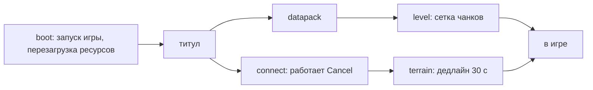
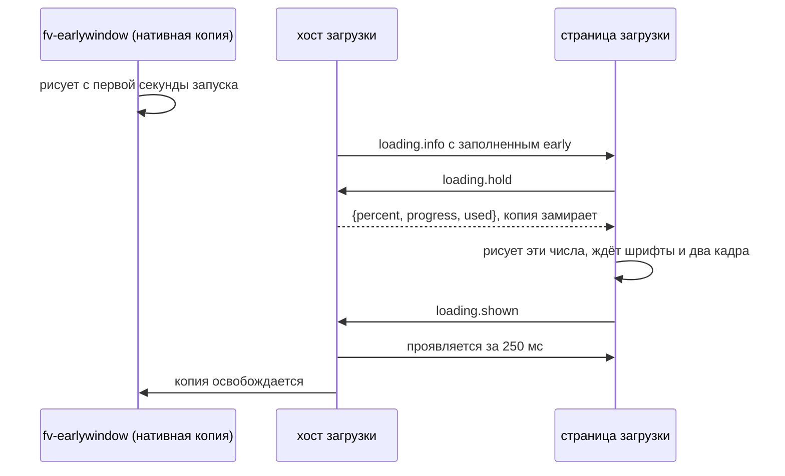

# Страница загрузки

Один поток, пять фаз. Всё, что заставляет игрока ждать, отправляет одни и те же две темы, так что
пак пишет один entry `loading`, и он обслуживает запуск, загрузку мира и каждый вход на сервер.

| фаза | экран | прогресс | действия |
|---|---|---|---|
| `boot` | оверлей загрузки игры | перезагрузка ресурсов, 0..1 | нет |
| `datapack` | `GenericMessageScreen`, `ProgressScreen` | процент этапа, иначе неопределённый | нет |
| `connect` | `ConnectScreen` | неопределённый | `cancel` |
| `level` | `LevelLoadingScreen` | слушатель чанков, 0..1 | нет |
| `terrain` | `ReceivingLevelScreen` | неопределённый, с дедлайном | нет |



`boot` рисуется поверх оверлея загрузки игры, который продолжает делать настоящую работу (перезагрузка, индикатор
прогресса, колбэк завершения, снятие примерно через 2 с после перезагрузки); страница проигрывает свой финал внутри
этого времени. Остальные четыре — скины живых ванильных экранов, так что их логика не сдвигается:
блокирующий цикл загрузки мира, 30-секундный таймаут terrain и гонка отмены подключения остаются ванильными.
Страница рисуется поверх всего кадра этих экранов, поэтому их собственный текст статуса исчезает
под ней.

Два правила отличают этот экран от остальных:

- шина событий игры NeoForge не запущена во время загрузки модов, поэтому в `boot` не опрашивается ни одна тиковая тема,
  а движок прокачивает сам хост загрузки. Всё, что нужно странице, — push-темы.
- в `boot` нет экрана, на котором можно спросить, поэтому право уровня ask отклоняется, а запрос ждёт
  титула. Пак, которому там нужно закрытое действие, выглядит сломанным без всякого запроса. Не делайте так.

Первый кадр оверлея пишет в лог, поверх какого хоста он работает:

```txt
fvmenu: loading page over WebLoadingOverlay, early window on (fv-earlywindow copy)
```

## Темы

`loading.info` отправляется один раз, когда начинается фаза. Каждая фаза заполняет все ключи, неизвестные — null:

```json
{
  "phase": "level",
  "minecraft": "1.21.1",
  "neoforge": "21.1.250",
  "mods": [{"id": "fvui", "name": "FateVis UI", "version": "0.1.0"}],
  "early": null,
  "title": "Loading world",
  "reason": null,
  "world": {"id": "north", "name": "Northern Reach"},
  "server": null,
  "grid": {"diameter": 25, "fullDiameter": 27}
}
```

- `early` — доля полосы, которую уже показала копия в раннем окне, только в `boot`. Страница, которая
  её видит, пропускает анимации появления, потому что игрок уже секунду смотрит на ту же
  раскладку.
- `title` — одна строка, которой фаза себя называет, на языке игрока.
- `reason` — `nether_portal`, `end_portal` или `other`, только в `terrain`. Две портальные причины —
  это GL-эффекты, которые страница нарисовать не может, поэтому скин приходит с `backdrop: false`, и страница должна оставаться
  прозрачной поверх них.
- `world` — одиночное сохранение, `server` — `{address, name, lan}` сервера, на который идёт вход.
- `grid` — сетка чанков фазы `level`, которую страница рисует островом ([Экраны](/ru/fv-menu/surfaces)).

`loading.progress` отправляется каждые 100 мс в `boot` и раз на кадр рендера в остальных четырёх:

```json
{
  "phase": "level",
  "progress": 0.62,
  "indeterminate": false,
  "done": false,
  "stage": "Loading world",
  "detail": "62%",
  "bars": [{"label": "Minecraft Progress", "progress": 0.4, "steps": 12}],
  "reload": null,
  "messages": [],
  "deadline": null,
  "memory": {"used": 812, "max": 2048},
  "actions": []
}
```

Что делает это одним потоком: `progress` всегда 0..1 и всегда присутствует, 0 при `indeterminate`;
`bars`, `messages` и `reload` вне `boot` пустые, а не отсутствуют; а `stage` и
`detail` — две строки, которые заполняет каждая фаза, так что пак, который привязал эти две и полосу, работает во
всех пяти, не зная, в какой находится.

- в `boot` значение `progress` уже пересчитано в то, что осталось после ранней доли:
  `early + (1 - early) * raw`. `bars` — индикаторы прогресса FML; индикатор без шагов сообщает 0,
  потому что 0/0 — это NaN, а JSON его не переносит. `messages` — четыре самые новые строки лога, собранные из
  новых сообщений FML, появления и завершения индикаторов и завершения слушателей перезагрузки.
- `deadline` — абсолютное время настенных часов в миллисекундах, никогда не обратный отсчёт, так что данные, которые не
  меняются, не отправляются. `terrain` сдаётся через 30 с после открытия; вычитает страница.
- `memory` — в MB. `actions` перечисляет, что `loading.act` принимает прямо сейчас.
- `done` равен true в последней отправке фазы — это сигнал к финалу. Он принадлежит фазе,
  с которой пришёл: страница, которая хранит флаг финала, должна сбрасывать его при смене фазы, иначе
  следующая фаза начнётся невидимой.
- Четыре экранные фазы приходят ещё и в данных `mode` как `loading` (`{info, progress}`), на один
  eval раньше тем. Применяйте сначала их, см. [Экраны](/ru/fv-menu/surfaces).

Минимальная страница загрузки:

```js
fvui.call('state.sub', { topics: ['loading.info', 'loading.progress'] });
fvui.state('loading.progress', (p) => {
  document.getElementById('stage').textContent = p.stage + ' ' + p.detail;
  document.getElementById('bar').style.width = Math.round(p.progress * 100) + '%';
});
```

## `loading.act`

Метод моста вида меню, а не id действия, как и `skin.act`. Он только нажимает кнопку, которую
экран и так показывает, поэтому это право уровня always: всё, что стоит за кнопкой, включая
флаг отмены и netty future, остаётся ванильным.

| действие | когда | эффект |
|---|---|---|
| `cancel` | `actions` его содержит, то есть в `connect` | нажимает ванильную кнопку Cancel |

```js
fvui.call('loading.act', { action: 'cancel' })
```

SDK оборачивает это как `loadingAct({ action: 'cancel' })`.

## Передача от раннего окна

`fv-earlywindow` — необязательный отдельный jar, который рисует нативную копию страницы загрузки с
первой секунды запуска, когда ещё не существует ни одного мода. Это не пак, и тему он не читает, так что пак,
перекрашивающий загрузку, всё равно отличается от этой первой секунды. Ему нужно
`earlyWindowControl = true` в `config/fml.toml` — это значение NeoForge по умолчанию.

Когда копия на экране, страница продолжает её полосу и лог, а не начинает заново, и на виде меню
существуют два дополнительных метода моста:

| метод | аргументы | результат |
|---|---|---|
| `loading.hold` | нет | `{percent, progress, used}` замороженной копии или null |
| `loading.shown` | нет | null, отмечает начало перекрёстного перехода |

Последовательность, которой следует штатная страница и которую стоит повторить паку:

1. прочитать `loading.info`; если `early` равен null, запустить обычное появление и пропустить остальное.
2. вызвать `loading.hold`. Копия перестаёт двигаться и отвечает своими текущими числами, так что страница может
   нарисовать ровно то, на что смотрит игрок.
3. нарисовать эти числа, дождаться первой отправки `loading.progress`, фонового изображения,
   `document.fonts.ready` (не дольше 2 с) и двух отрисованных кадров.
4. вызвать `loading.shown`. Страница проявляется за 250 мс, после чего копия освобождается.



До `loading.shown` страница рисуется с альфой 0, так что страница, которая его никогда не вызывает, никогда не видна.
Без копии страница рисуется с полной альфой с первого кадра, и ни одного из этих методов нет.

## Финал

Оверлей снимается примерно через 2 с после завершения перезагрузки. Страница рисуется и в этом кадре снятия,
так что переход принадлежит ей: растворите содержимое загрузки в фон, который титульный экран продолжает
рисовать, а не давайте оверлею резко переключиться на голую панораму. Сигнал — `progress.done`.

После снятия хост переключается на `title`, если только титульный экран не был уже инициализирован —
тогда переключение происходит в момент, когда страница загрузки закончила. Четыре экранные фазы заканчиваются
так же: последней отправкой с `done` true и `progress` 1, когда их экран исчез.

## Демо без игры

`?demo=loading&phase=boot|datapack|connect|level|terrain|all` запускает штатную мок-последовательность;
`phase=all` проигрывает boot 14 с, datapack 2 с, connect 3 с, level 6 с и terrain 2 с на одних часах.
`&t=<seconds>` перематывает на один момент вместо проигрывания — это и снимает харнесс
без игры. Сетка чанков и кукла сущности нативные, так что демо рисует их рамки и ничего
внутри них.

<DemoLoading />
