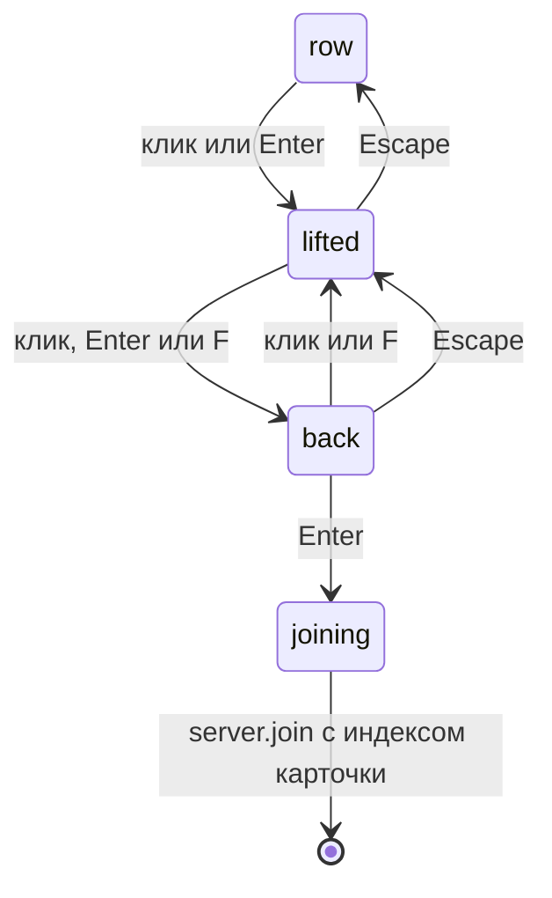

# Карточки серверов: список мультиплеера как коллекционные карточки

Демонстрация того, что умеет меню на странице и не умеет меню на виджетах: каждый сохранённый сервер — пиксельная коллекционная
карточка на плоскости three.js, редкость берётся из часов, наигранных на этом сервере, а акцентный цвет —
из собственной иконки сервера. Вид включается по желанию, обычный список всегда в одной клавише, и любой путь отказа
заканчивается этим списком.

## Как включить

`ui.serverView` в хранилище пака: `list` (по умолчанию) или `cards`. C на титуле переключает его:

| ключ | значения | по умолчанию | эффект |
|---|---|---|---|
| `ui.serverView` | `list`, `cards` | `list` | какую панель мультиплеера показывает титул |
| `ui.serverSort` | `list`, `tier`, `joined`, `name`, `ping` | `list` | порядок строк |
| `ui.showcaseQuality` | `off`, `low`, `high` | `high` | при `off` рендерер не создаётся вообще |
| `ui.reducedMotion` | `auto`, `on`, `off` | `auto` | когда включено: без наклона, мгновенный подъём и мгновенный переворот |

Все они — строки в панели пака, которую на титуле открывает K: это собственные ключи страницы, и
ванильной строки в Options, к которой их можно было бы привязать, нет.

`auto` для уменьшенного движения — эвристика, потому что в 1.21.1 такой настройки нет: он считается включённым, когда
срабатывает `prefers-reduced-motion: reduce`, когда псевдоним `ui.motion` равен `off` или когда игрок
обнулил `panoramaSpeed`. Servo 0.5 отвечает на этот media query false, что бы ни говорил рабочий стол, так что на
практике решают ключи хранилища и скорость панорамы. На карточках уменьшенное движение убирает пружину наклона,
кривую подъёма, кривую переворота и покачивание в покое, а блики оставляет: они зависят от угла зрения, а не
от времени, и у неподвижной карточки их набор фиксирован.

## Откуда берутся данные

Новой поверхности моста здесь тоже нет; это тема `servers` из главы [Темы и действия](/ru/fv-ui/topics-actions), к которой добавилось пять ключей.

- `servers` — для строки, соединяется с `servers.stats` по нормализованному `address` и никогда по
  индексу списка, который сдвигается, когда игрок переставляет `servers.dat`.
- `icon` — адрес `fvui://servericon/<key>.png?v=<epoch>` с ключом — хешем байтов иконки, так что два
  сервера с одинаковой иконкой делят один файл, одну загрузку и один акцент.
- `accent` и `accent2` квантуются в Java один раз на каждую отдельную иконку. Когда их нет — более
  старый мод или прямое подключение, пинг которого ещё не ответил, — `cards/accent.ts` прогоняет тот же
  k-means по декодированной иконке на странице, и карточка перекрашивается тем, что он нашёл. Сервер
  вообще без иконки берёт `--glow` меню и рисует узор без картинки, что читается как
  намеренное решение.
- `motdRuns` несёт MOTD парами `(text, colour)`, не больше двух исходных строк. Холсту нужно
  *имя* цвета, чтобы попасть в палитру карточки, поэтому `motdHtml` здесь не годится.
- `servers.stats` даёт `hours` по адресу; `cards/tier.ts` выводит из них редкость, и нигде
  она не хранится.

## Модули

```txt
src/cards/device.ts   the page's one adapter and device, and the loss listener
src/cards/layout.ts   every number of cards.json: rects, camera, lift, tilt, glint, sheen
src/cards/tier.ts     hours => tier, and the ornament and foil table
src/cards/accent.ts   colour helpers, the card palette, the page side icon quantiser
src/cards/text.ts     fold, fit, wrap, clip: the fitting rules, with the widths injected
src/cards/art.ts      the pixel painters: frame, ornaments, badge, patterns, bars, foil mask
src/cards/font.ts     the baked player font on the canvas, and the charset it covers
src/cards/face.ts     one 300 x 420 face canvas per card
src/cards/foil.ts     the TSL node graph: flake glints, rainbow sheen, matte lobe
src/cards/spring.ts   the tilt spring and the lift eases, pure functions
src/cards/flip.ts     the row => lifted => back state machine, a pure reducer
src/cards/sort.ts     the five row orders, page side only
src/cards/model.ts    servers + servers.stats => one card model each
src/cards/state.ts    the refs the row, the stage and the title share
src/cards/stage.ts    scene, plane placement, tilt, lift, flip, frame loop
src/cards/CardRow.vue the DOM row, the rects, the gestures and the keyboard
src/cards/CardStage.vue  the canvas over it
src/cards/NoteEditor.vue the textarea over the projected note box
```

Ряд — это CSS, а плоскости следуют за ним: `CardRow.vue` раскладывает по кнопке на сервер, а сцена
читает их `getBoundingClientRect()` и кладёт под каждую плоскость. Прямоугольники читаются при монтировании, при смене `gui.scale`, при прокрутке и при
изменении размера окна, но никогда через `ResizeObserver`, которого в servo 0.5 нет. DOM-карточки остаются
с нулевой непрозрачностью, а не с `visibility: hidden`, который забрал бы с собой их наведение, кольцо фокуса и
место в дереве доступности; пока сцена не нарисовала кадр, они показывают плоскую
замену, так что медленное устройство никогда не показывает пустую полосу.

Камера сохраняет fov концепта и его отношение расстояния к карточке, а не абсолютные числа:
карточка — 2.5 x 3.5 единицы, единицы на пиксель берутся из измеренного ряда, а камера отодвигается
соответственно. Подъём тогда приближает на ту же долю расстояния камеры, что и рендер в Blender,
какой бы ширины ни получилась правая колонка.

## Текст шрифтом игрока

Концепт измеряет в равномерном шрифте 3x5, где шаг равен `4 * scale` px. У запечённого шрифта игрока
шаги переменные, а его сайдкар — список отдельных корзин шагов, а не таблица ширин,
поэтому `text.ts` сохраняет каждое *правило* из cards.json, а каждую *ширину* берёт из `ctx.measureText` через
внедрённый `Measure`. Масштаб — наибольшее целое кратное 8 px (em — это 8 игровых пикселей),
при котором измеренная ширина помещается в полосу, а «30 символов в строке» становится шириной рамки — это
тот же бюджет в собственных метриках концепта. Измерения запоминаются по тексту и масштабу, так что
поиск подгонки никогда не доходит до пути перерисовки.

`fold` отбрасывает то, чего нет в запечённом шрифте, и сводит капитель и диакритику к обычным буквам —
благодаря этому MOTD, написанный декоративным Юникодом, становится читаемым. В отличие от концепта, он сохраняет
регистр исходника: у шрифта 3x5 не было строчных, а у запечённого они есть.

Базовая линия — собственная метрика игрового шрифта, 7 из 8 игровых пикселей em над ней, а **не**
`ascent` из сайдкара: это другое число, и оно поднимало каждый заголовок на целую полосу над его рамкой.

## Как лицевая сторона попадает на GPU

`face.ts` рисует холст 300 x 420 на карточку, и плоскость носит его, но путь не очевидный:
servo 0.5 вообще не может взять canvas как источник текстуры WebGPU. `copyExternalImageToTexture`
оставляет текстуру нулевой и ничего не пишет в лог, `` на `data:` ведёт себя так же, а
`createImageBitmap` и `canvas.toBlob` никогда не вызывают колбэк. Поэтому `pixelsOf` читает холст через
`getImageData`, переворачивает строки, и пиксели уходят наверх как `DataTexture`, который загружается правильно.
В том же файле обойдены ещё две ловушки из главы [Матрица поддержки Servo](/ru/fv-ui/servo): один контекст на холст, потому что
второй `getContext('2d')` отвечает пустым, и ступенчатый срез угла, потому что `clearRect`
очищает весь холст, какой бы прямоугольник ему ни дали.

Поэтому перерисовка пересобирает текстуру и материал карточки — вот почему перерисовка происходит, только когда
данные действительно изменились. `canvasReadable()` при запуске проверяет один пиксель, так что движок, который не может прочитать
холст обратно, уступает место обычному списку со строкой в логе, а не рисует пустые прямоугольники.

## Фольга

`foil.ts` — первый написанный вручную граф TSL в дереве. Один материал на весь ряд, который переносится на
ту карточку, что поднята или под указателем, так что блики стоят одной компиляции шейдера, а покоящаяся карточка
ничего не платит:

- двумерный хеш ячеек с 90 ячейками на ширину карточки даёт каждой ячейке случайную нормаль чешуйки, а
  `smoothstep(0.9985, 0.9996, dot(flake, view))` оставляет освещёнными около 0.6 процента из них под любым одним
  углом. Это узкое окно и есть весь фокус: несколько градусов наклона меняют набор освещённых ячеек, так что
  карточка искрится, а не гоняет по себе градиент.
- цвет чешуйки — `mix(white, accent, 0.5)`, сдвинутый на 30 процентов к собственному оттенку ячейки, с
  силой блика уровня редкости, умноженный на точечную маску и маску фольги.
- `epic` и `legendary` добавляют слабый радужный отлив, оттенок которого смещается с вектором взгляда, а
  на `legendary` — ещё и со временем. Матовые уровни получают широкий блик, который заполняется, когда карточка поворачивается к вам,
  а не глянцевый лепесток.

Вектор взгляда — это `cameraPosition`, переведённый в собственное пространство карточки на CPU и переданный
как uniform, то есть `inverse(modelMatrix) * cameraPos` из концепта без матричного uniform.
Маска фольги — второй одноканальный холст поверх тех же прямоугольников, так что иконка, текстовые рамки и
значок никогда не искрятся, и ни одна маска в PNG не поставляется.

## Графика и ассеты

Каждый пиксель — наш. `art.ts` рисует тело, акцентную полосу в 10 px, контуры, четыре
орнамента (`plain`, `studs`, `double`, `engraved`), плашку редкости с одной точкой на ступень, диагональный
и решётчатый узоры и ступенчатый угол в 12 px — всё целочисленными `fillRect` от акцента иконки.
Ступенчатый край карточки живёт в альфе текстуры, а не в геометрии, так что карточка — это одна плоскость.

Ничто не является ассетом времени выполнения. `npm run gen:cardart -w fvmenu-web` рендерит пять рамок редкости с
нейтральным акцентом в `web/menu/test/fixtures/cards/` как эталон, по которому меряет тест
композиции, импортируя сам `src/cards/art.ts`, так что эталон не может разойтись с рисовальщиком.
`npm run gen:mockicons -w fvmenu-web` пишет восемь иконок 64x64 для харнесса. Ни фавикона настоящего сервера,
ни графики из мокапа в репозитории нет.

## Оборот и переворот карточки

Карточка находится в одном из трёх состояний, и `cards/flip.ts` — это оно целиком: чистый редьюсер, без часов,
без GPU, без DOM, так что последовательности — это тест vitest, а сцена лишь анимирует то, что он отвечает:



```txt
row  --click/Enter-->  lifted  --click/Enter/F-->  back  --click/F-->  lifted  --Escape-->  row
```

Жест на другой карточке всегда застаёт ту карточку в ряду — благодаря этому клавиша-стрелка переносит
подъём с собой, ничего не переворачивая. Enter отвечает по состоянию: поднимает, затем переворачивает,
затем заходит на сервер.

Оборот несёт акцентную решётку, заметку — до четырёх перенесённых строк блока `text` из
`cards.json`, три строки статистики — `HOURS`, `JOINS` и `LAST`, относительную отметку («2 H AGO», «3 D AGO», «NEVER»), — и
тот же значок редкости, что на лицевой стороне. Он рисуется при первом перевороте и отбрасывается, когда карточка возвращается
в ряд: перевёрнута всегда только одна карточка, а оборот на каждую удвоил бы счёт за текстуры
впустую.

Поворот — 180 градусов вокруг вертикальной оси за 0.7 с, `easeInOut`, и угол всегда только
растёт — от 0 до 180, затем от 180 до 360, — так что карточка никогда не раскручивается обратно тем же путём. После середины
материал берёт текстуру оборота, пиксели которой отзеркалены на CPU, потому что плоскость
видна сзади; зеркало — это не `texture.repeat`, которому движок на data-текстуре никогда не давали
отрицательным. Фольга проходит через поворот, и её член `1 - abs(view.z)` достигает пика, когда
карточка встаёт ребром, — это блик, ловящий свет посреди поворота; именно `abs`, а не обрезка до
нуля, иначе оборот, смотрящий прямо на вас, сидит на полном отливе и выцветает в серый. Пока оборот открыт, покачивание
на 1.5 градуса с частотой 0.35 Гц — единственное, что держит цикл «грязным» без ввода указателя, так что именно его
уменьшенное движение убирает первым — там весь переворот сводится к смене положения.

## Поле заметки

Текст на холсте нельзя редактировать, а IME в servo нет, поэтому заметка — настоящая `<textarea>`:
`NoteEditor.vue` поверх собственной рамки заметки на обороте, спроецированной из сцены через
`CardStage.projectRect` — четыре угла прямоугольника лица через мировую матрицу карточки и
камеру, — с запечённым шрифтом в том же масштабе текста, в каком его нарисует карточка. Цель наклона
принудительно плоская, пока поле открыто, так что текст не движется под кареткой.

Enter сохраняет, Escape откатывает, потеря фокуса сохраняет, лимит — 240 символов. Сохранение — это
`servers.note.set`; Java-половина пишет `fvui/stats.json` и отправляет `servers.stats` обратно, и эта
отправка перерисовывает оборот. Пока поле открыто, клавиатура принадлежит ему: собственный оконный
обработчик титула уступает по флагу `editing` из `cards/state.ts`, иначе каждая набранная буква была бы ещё и горячей клавишей
титула.

## Действия и порядок строк

| что | как |
|---|---|
| зайти | `server.join` с собственным `index` карточки, который сортировка никогда не сдвигает |
| обновить пинг | `servers.refresh`, тот же пинг, что титул запускает при каждом показе |
| изменить, добавить, удалить | `open` с `edit-server` и индексом, [Темы и действия](/ru/fv-ui/topics-actions): `servers.dat` принадлежит ванильному экрану |
| заметка | `servers.note.set`, см. выше |
| сортировка | только на стороне страницы, `ui.serverSort` в хранилище пака |

Пять порядков: `list` (порядок `servers.dat`, по умолчанию), `tier` (часы по убыванию),
`joined` (последняя сессия по убыванию), `name` и `ping`. Сервер, который ни разу не ответил, сортируется последним,
какое бы число ни стояло в его поле пинга. Ничто здесь не переставляет `servers.dat`, так что `index` остаётся
ключом, который принимает `server.join`.

## Ввод

Left и Right двигают фокус и переносят подъём с собой; Enter поднимает, переворачивает и заходит — по
состоянию; Escape отступает на одно состояние за раз. F переворачивает карточку, N открывает заметку, R пингует заново, E
открывает ванильный редактор для этого сервера, S перебирает порядки, а L возвращает обычный список.
Клик поднимает карточку, следующий клик её переворачивает. Наклон следует за указателем через демпфированную
пружину (`k` 120, `c` 14 в секунду, конус 8 градусов, 6 при ширине меньше 1280 px) и возвращается в плоское положение
через 300 мс после остановки указателя.

Клавиши карточки висят на её собственной кнопке, а не на окне, потому что оконный обработчик
над страницей с текстовым полем съедает каждую набранную в нём букву. Поэтому ряд вызывает `.focus()`
вручную при клике и забирает фокус обратно, когда поле заметки закрывается, а не доверяет
собственному фокусу движка по клику.

## Нижний порог уменьшения

Три карточки в колонке `clamp(320px, 32vw, 440px)` — это карточка в 140 пикселей устройства из лица в 300
пикселей: пересчёт 0.47x с ближайшим
соседом, где штрих в два текселя может попасть между двумя выборками и исчезнуть. Именно это съело
точки в `1.21.1` в M15a. `minScaleFor` в `text.ts` отвечает числом текселей на пиксель устройства, округлённым
вверх и ограниченным 4, а заголовок и версия рисуются не мельче этого масштаба, так что каждый штрих
попадает хотя бы на одну выборку.

Счётчик и MOTD сохраняют масштаб 2 из концепта. Это цифры, косая черта и проза, которые переживают
пересчёт как мягкий край, а не дырку; более жирный счётчик вытолкнул бы версию из
подвала, а более жирный MOTD стоил бы трети символов в строке — той информации, ради которой эти
рамки существуют. Порог входит в ключ перерисовки, так что перерисовку вызывает изменение размера и ничто другое.

## Рендерер и что делает отказ

`renderer.backend.isWebGPUBackend`, равный false, — это отказ, а не
понижение качества, и каждый путь заканчивается одной строкой в логе, обычным списком `ServerPanel` и без повторных попыток.

```txt
cards: falling back to the server list, navigator.gpu missing
cards: falling back to the server list, requestAdapter answered null
cards: falling back to the server list, the engine cannot read a 2D canvas back
cards: falling back to the server list, init rejected: ...
cards: falling back to the server list, WebGPURenderer fell back to WebGL2
cards: falling back to the server list, device lost: ...
cards: falling back to the server list, render failed: ...
cards: falling back to the server list, the canvas would not give its pixels up
```

Успех один раз пишет `gpu: one device for the page`, затем `cards: three r186, isWebGPUBackend true`
и по одной строке `cards: <n> planes, <w>x<h> buffer, <n> px per unit` на каждое изменение раскладки.

## Как запустить

```txt
# harness, mock servers, no game behind it
cd native && FVUI_PATH='index.html?demo=cards' FVUI_SHOTS=1200,3000,4500,6500 \
  xvfb-run -a -s "-screen 0 1920x1080x24" env -u WAYLAND_DISPLAY \
  ./target/release/examples/headless ../web/menu/dist out.png examples/mock 1920x1080

# the same, walking the lift, the turn and the note field on a timeline
FVUI_PATH='index.html?demo=cards&drive=1' FVUI_SHOTS=1200,3150,4200,6000,7600

# dev client over the real server list
cd mods && xvfb-run -a -s "-screen 0 1920x1080x24" env -u WAYLAND_DISPLAY \
  ./gradlew :menu:runClient -PdevOut=.work/m15b/client -PdevCards=true \
  -PdevServer=127.0.0.1:25565 -PdevQuit=true
```

`-PdevOut` отсчитывается от корня репозитория, а не от `mods/`. `&drive=1` — драйвер харнесса в
`src/demo/cards.ts`: 400 мс подъём, 2800 мс поворот (то есть 90 градусов на 3150), 5000 мс поле заметки, затем
Escape обратно в ряд. `-PdevCards` проходит тот же путь настоящими кликами и настоящими клавишами и заходит
на dev-сервер с оборота его собственной карточки.

`-PservoPrefs=dom_webgpu_enabled=false` на том же запуске доказывает откат: панель мультиплеера
остаётся обычным списком, и в лог пишется ровно одна строка.
