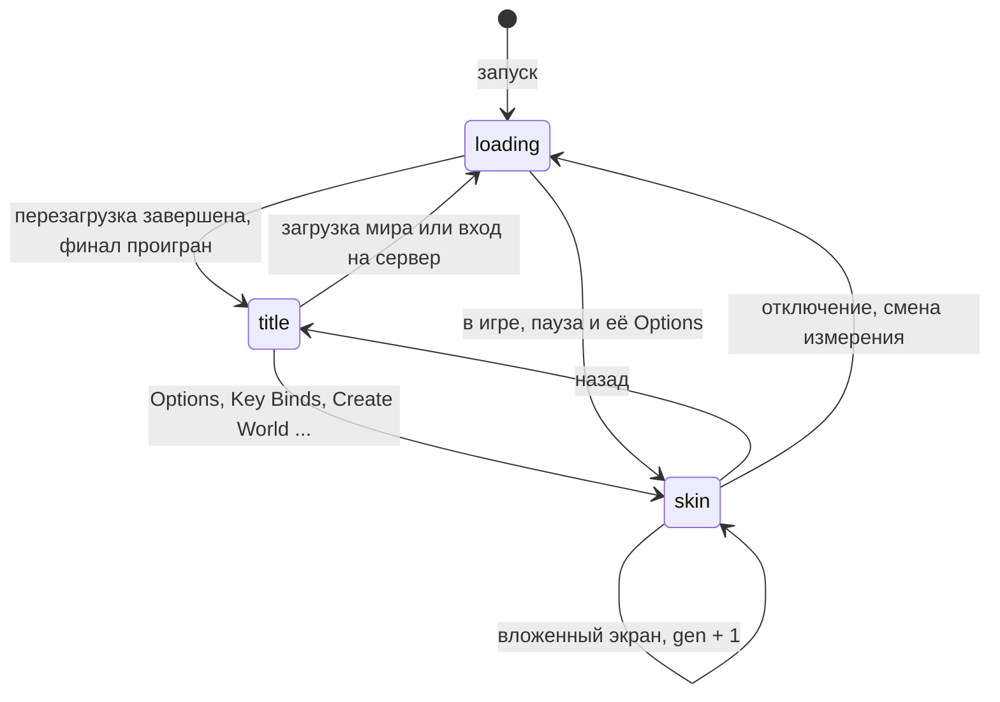
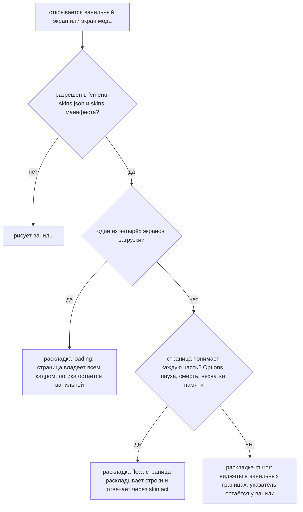

# Экраны и модель скинов

Меню — это один WebView и один документ. Он не загружает страницу на каждый экран, а переключает режимы.

## Режимы

Хост шлёт `mode` при каждой смене экрана:

```js
fvui.on('mode', (e) => {
  // e.mode: "loading" | "title" | "skin", e.gen: a counter, e.data: per mode
  render(e.mode, e.data);
});
```



| режим | экран | `data` |
|---|---|---|
| `loading` | `loading` | null, всё лежит в темах `loading.*` |
| `title` | `title` | null, всё лежит в `title.state`, `worlds`, `servers` |
| `skin` | `skin` | сведения об экране плюс первый снимок его виджетов |

`gen` считает переключения — это ключ, по которому для повторного режима рисуется свежий вид. Данные титула
остаются в хранилище тем после последней отписки, так что при возвращении на титул рисуется
полный первый кадр.

Кадры при переключении никогда не придерживаются. Пара кадров предыдущей страницы выглядит лучше, чем
проблеск ванильного экрана, — поэтому данные `skin` несут первый набор виджетов.

## Адрес страницы

Адрес текущего экрана строит игра, так что первый кадр полон ещё до того, как прошёл хоть один
тик:

```txt
fvui://menu/index.html?blur=5&speed=1.0&splash=1&contrast=0&pack=example&preset=default&theme=fvui%3A%2F%2Fmenu%2Ftheme.css%3Fr%3D0&r=1
```

| параметр | значение |
|---|---|
| `blur`, `speed`, `splash`, `contrast` | четыре клиентские настройки, они же тема `options.prefs` |
| `pack` | id активного пака, ключ его хранилища |
| `preset` | `default`, `high-contrast` или `vanilla` |
| `theme` | адрес файла темы пака; отсутствует, когда пак его не объявляет |
| `backdrop-sharp`, `backdrop-blur5`, `backdrop-blur10`, `backdrop-loading` | значения токенов `--backdrop-*` из `backdrop` манифеста; отсутствуют, когда он их не объявляет |
| `r` | поколение перезагрузки пака; отсутствует при первой загрузке |

Настоящую загрузку определяет только файл entry. Смена пресета, смена режима внутри одного файла и
смена настроек никогда не перезагружают страницу.

## Экраны

`title`, `loading` и `skin` — в виде меню. `hud`, `editor` и `container` принадлежат fvhud,
см. [Экран HUD](/en/fv-hud/hud-surface). Пак объявляет нужные ему в `entries`; остальные берутся из штатного пака,
файл за файлом.

Страница может реализовать все три в одном файле и ветвиться по `mode` — так делает штатный пак,
и это избавляет переключения от вспышек.

## Скины

Экран со скином сохраняет всю свою логику, страница берёт на себя внешний вид. `SkinModel` выбирает одну из трёх
раскладок и сообщает её в сведениях об экране:

| раскладка | когда | кто владеет указателем |
|---|---|---|
| `flow` | Options, пауза, смерть и нехватка памяти — там, где страница понимает каждую часть | страница |
| `mirror` | любой другой экран со скином | ваниль |
| `loading` | четыре экранные фазы потока загрузки, [Страница загрузки](/ru/fv-menu/loading) | ваниль |



В flow страница раскладывает экран сама, экспортируются все строки списков, а обратно она шлёт действия.
В mirror страница рисует виджеты в ванильных границах, а клики, фокус, звуки,
ползунки, ввод текста и прокрутка остаются за ванилью. Flow используется, только когда под страницей не остаётся ничего ванильного,
потому что flow уводит указатель от всего, чего страница не рисует.

В loading страница владеет кадром на всё окно, а `phase` в сведениях об экране говорит, к какой
фазе `loading.info` он относится. Ванильная отрисовка этих экранов отменяется полностью, так что
их нарисованный от руки текст статуса ванильным шрифтом исчезает, а не остаётся читаемым под
полупрозрачным кадром; сетка чанков загрузки уровня возвращается как остров, который размещает страница. Портальный
terrain — исключение: он сохраняет свою отрисовку, а его скин остаётся прозрачным, потому что этот
фон — GL-эффект, который страница нарисовать не может. Под любым кадром страницы игра заливает цвет ink страницы,
а не панораму, так что ненадолго полупрозрачная страница показывает ink, а не ванильное меню.

Каким экранам вообще ставится скин: `config/fvmenu-skins.json` с `enabled`, `modScreens`,
`include` и `exclude`, и блок `skins` манифеста, слитый под него. Пак только добавляет правила,
`exclude` читается раньше `include`, так что файл конфига всегда может наложить вето. Скин никогда не ставится на: сами
веб-экраны, экран согласия, контейнеры, чат, книги, таблички, титры и загрузку уровня.
Контейнеры — собственный экран fvhud и никогда не fvmenu, так что два мода не могут одновременно владеть одним экраном.
С экраном чата то же разделение: его рисует fvhud с экрана HUD, потому что он стоит на истории
чата, которой страница HUD уже владеет, и сохраняет ванильное текстовое поле. См. [Экран HUD](/en/fv-hud/hud-surface).

## Сведения об экране

`data` режима `skin` и поля, которые читает раскладка:

```json
{
  "id": "net.minecraft.client.gui.screens.options.OptionsScreen",
  "name": "OptionsScreen",
  "layout": "flow",
  "phase": null,
  "title": "Options",
  "titleKey": "options.title",
  "parent": "Options",
  "inGame": false,
  "unit": 2.0,
  "choiceControl": "auto",
  "backdrop": true,
  "widgets": [ ... ],
  "loading": null
}
```

`unit` — CSS-пиксели на GUI-пиксель, число, которое превращает ванильные границы в координаты страницы.
`parent` есть только у вложенного экрана. `inGame` равен true, когда загружен уровень, так что страница
остаётся прозрачной поверх мира. `backdrop` false значит, что экран рисует поверх кадра страницы и
страница не должна закрашивать непрозрачный фон. `choiceControl` приходит из ключа хранилища пака
`ui.choiceControl`. `phase` задаётся только для раскладки `loading`, как и `loading`: первые
`loading.info` и `loading.progress` этой фазы, которые едут здесь, потому что переключение — это eval, а
темы — сброс состояния, который приходит после него. Примените их до отрисовки режима, иначе страница
разложит новую фазу по числам предыдущей.

## Виджеты

`skin.widgets` — плоский список, который отправляется после каждой отрисовки экрана со скином и сравнивается, так что
неизменившийся экран ничего не стоит. У каждой записи есть:

```json
{"id": 7, "kind": "cycle", "x": 240, "y": 320, "w": 300, "h": 40, "visible": true, "clip": 3}
```

`x`, `y`, `w` и `h` — в CSS-пикселях. `clip` — id списка, которому принадлежит запись; строки, которые
страница раскладывает сама, несут нулевые границы, и позиционирует их страница.

| вид | источник | дополнительные поля |
|---|---|---|
| `button` | любая кнопка | общий набор, см. ниже |
| `link` | `PlainTextButton` | общий набор |
| `tab` | `TabButton` | `selected` |
| `cycle` | `CycleButton` | `values`, `index`, `selected` для настройки ON/OFF |
| `checkbox` | `Checkbox` | `selected` |
| `slider` | кнопка-ползунок | `value`, от 0 до 1 |
| `input` | `EditBox` | `value`, `cursor` |
| `text` | строковый виджет | `align` |
| `list` | список, строки которого рисует страница | `scroll`, `maxScroll`, оба в CSS px |
| `native` | кнопки-иконки, нестандартные виджеты, списки со строками, нарисованными от руки | `scroll`, `maxScroll` для списков |
| `key` | строка привязки клавиши, только flow | `valueText`, `conflict`, `waiting`, `unbound`, `reset` |
| `choice` | строка языка, только flow | `selected` |

Общий набор у всего, кроме `native`: `label`, `key` (ключ перевода, когда он у подписи
есть), `active`, `focused`, `hovered` и `tooltip`, когда на виджете указатель или раскладка —
flow. Виджеты настроек несут ещё `caption` (имя настройки) и `valueText` (переведённое значение
без имени), так что странице не нужно разбивать подпись.

`values` у cycle — тексты всех значений, `index` — текущее. Списки длиннее 64 значений
опускаются, и элемент остаётся переключаемым по клику.

Строка `key` несёт кнопку изменения как свой виджет и `reset: {id, active}` для кнопки сброса
рядом с ней. `focused` задаётся только для конца пути фокуса экрана и только после клавиатурного
ввода или для текстового поля — так, как это показывает ваниль.

Записи native получают границы и больше ничего: ваниль рисует их поверх кадра страницы.

## skin.act

Раскладки flow шлют действия обратно. Это самостоятельный метод моста, а не id для `act`:

```js
const skinAct = (action) => fvui.call('skin.act', action);

skinAct({action: 'press', id: 7, fx: 0.5});
skinAct({action: 'set', id: 7, index: 2});
skinAct({action: 'drag', id: 9, fx: 0.35});
skinAct({action: 'release', id: 9, fx: 0.35});
skinAct({action: 'back'});
skinAct({action: 'blur'});
skinAct({action: 'modal', open: true});
```

| действие | аргументы | эффект |
|---|---|---|
| `press` | `id`, `fx` | повторяет клик на этой доле ширины виджета |
| `set` | `id`, `index` | задаёт значение cycle за один шаг с ванильным колбэком |
| `drag` | `id`, `fx` | тащит ползунок, один раз на кадр анимации |
| `release` | `id`, `fx` | завершает перетаскивание |
| `back` | нет | закрывает экран |
| `blur` | нет | снимает фокус экрана |
| `modal` | `open` | пока true, события клавиш идут странице, а не экрану |

`fx` по умолчанию 0.5 и ограничивается диапазоном 0..1. Нажатие на строку без виджета (строку языка)
выбирает её; второе быстрое нажатие применяет. `press` и `set` идут через собственный
`mouseClicked` экрана, потому что экраны реагируют именно там (так Video Settings открывает предупреждение Fabulous).
Действие над неактивным виджетом или над неизвестным id отвечает `false`.

Благодаря `modal` Esc закрывает выпадающий список страницы, а не экран.

## Раскладка паузы

`PauseScreen` — экран flow: его дочерние элементы — обычные кнопки и один строковый виджет, так что страница
раскладывает строки, а за ними по-прежнему работает каждый ванильный обработчик: достижения, статистика,
кнопка модов, ссылки обратной связи, Open to LAN или Player Reporting, и Save and Quit или Disconnect.
Сопоставляйте строки по ключу перевода (`menu.returnToGame`, `menu.options`, `menu.shareToLan`,
`menu.returnToMenu`) и давайте всему, что не узнали, собственное место: строка, которую добавил мод,
не должна лечь поверх той, что разместили вы.

`PauseScreen(false)` — тот, что игра открывает, когда окно теряет фокус, — не имеет ни виджетов, ни
фона, и скин на него никогда не ставится.

В игре страница рисуется поверх ванильного размытия, а мир под ней остаётся живым. `--shade` — насколько
страница затемняет мир, 0 не трогает его. Options, открытые из паузы, — это
`OptionsScreen` с `inGame` true и теми же токенами, так что два экрана выглядят непрерывно.

## Раскладка смерти

`DeathScreen` — тоже экран flow, и, как у экранов загрузки, его ванильная отрисовка отменяется:
заголовок, причина смерти и счёт рисуются от руки, без виджета, который можно скрыть, так что, если их просто
накрыть, они читались бы сквозь страницу. Страница владеет всем кадром, включая красный
градиент.

Обе кнопки приходят из снимка виджетов, так что возрождение или наблюдение, кнопка титульного экрана с
её вложенным экраном подтверждения и значок черновика жалобы сохраняют ванильные обработчики, а задержка в 20
тиков, прежде чем они станут активными, приходит как флаг `active`. Три поля, которые снимок
нести не может, приходят из отдельной темы:

```json
{ cause: "Dev was slain by Zombie", causeHtml: "...", causeToken: "1f4c...",
  score: "Score: 0", scoreHtml: "...", hardcore: false,
  top: 1615855616, bottom: -1602211792 }
```

`top` и `bottom` — собственные значения `fillGradient` ванили, упакованный ARGB. Причина кликабельна и
реагирует на наведение через действия `text.*` из главы [Темы и действия](/ru/fv-ui/topics-actions) — то, что `DeathScreen.mouseClicked` делает
сегодня для `OPEN_URL`, расширено на все действия, потому что указатель у страницы: сначала сообщите прямоугольники
фрагментов через `text.rects`, потому что клик вне сообщённого прямоугольника отклоняется.

`OutOfMemoryScreen` — простой экран flow с кнопками Back to Title и Quit, и собственная
раскладка ему не нужна.

## Острова

Некоторые вещи игра должна рисовать сама: сетку чанков, которая каждый кадр читается из состояния сервера,
сущность, в которую вмешивается каждый мод с моделями. Страница размечает рамку, сообщает её прямоугольник, а игра рисует
в него после кадра страницы.

```js
fvui.call('menu.rects', {
  epoch: 4, cssScale: 2,
  rects: [
    {key: 'grid', kind: 'grid', x: 760, y: 380, w: 100, h: 100},
    {key: 'player', kind: 'entity', entity: 'player', scale: 30, crouching: true,
     x: 940, y: 520, w: 36, h: 108, pointer: {x: 0.5, y: 0.4}}
  ]
});
```

В виде меню два вида, `entity` и `grid`, и не больше двух островов на экран; страница, которая
просит больше, получает одну строку warn, а лишние пропускаются. Прямоугольники — в CSS-пикселях. `pointer` —
нормализованный указатель страницы внутри прямоугольника, который игра превращает в два угла поворота, какие
ванильный инвентарь получает от мыши; без него поза фиксирована. Отправляйте пакет через кадр
после измерения, чтобы кадр, который его несёт, уже был отрисован, — `trackIslands` из SDK
делает это сам, хеширует прямоугольники и вызывает, только когда они сдвинулись.

Внутри цикла загрузки одиночного мира клиентского игрока ещё не существует, поэтому остров `entity`
ничего не рисует в фазе `level` локального мира. Рамку всё равно зарезервируйте; при входе на сервер
и на паузе это живая сущность.
