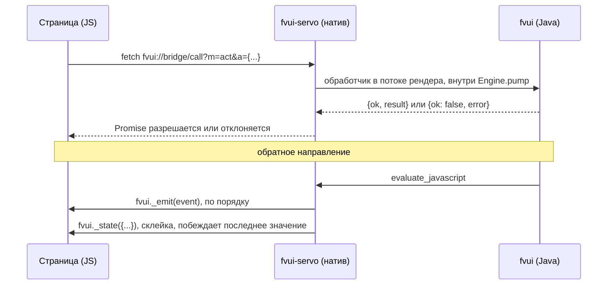

# Мост

`window.fvui` — это весь API на стороне страницы. Скрипт отдаёт игра, страница загружает его
раньше всего остального:

```html
<script src="fvui://bridge/bridge.js"></script>
```

Это классический скрипт, а не модуль: `window.fvui` существует уже на следующей строке. Повторная
загрузка ничего не делает.

## Состав

```js
fvui.native                 true in game, the mark of a real bridge
fvui.call(method, args)     one bridge call, returns a Promise
fvui.on(name, cb)           ordered events, returns an unsubscribe function
fvui.state(key, cb)         topic value plus every later push, returns an unsubscribe function
fvui.snapshot()             every topic value this page has seen, an object, for devtools
```

`fvui.state` вызывает колбэк сразу, если у ключа уже есть значение, так что поздний подписчик
обходится без лишнего запроса. `fvui._emit` и `fvui._state` — то, что вызывает игра, а не API для
страницы.

## Транспорт

Из JS в Java — это `fetch` адреса `fvui://bridge/call?m=<method>&a=<json args>` с `cache: "no-store"`,
на который асинхронно отвечает нативный обработчик протокола. Из Java в JS — `evaluate_javascript`
с вызовом `fvui._emit` (упорядоченные события) или `fvui._state` (состояние, где побеждает
последнее значение).



Обработчики выполняются в потоке рендера внутри `Engine.pump`, посреди кадра. Вызов никогда не
удерживается открытым на время показа экрана, поэтому ничего не истекает по таймауту: отклонённый
вызов получает ответ сразу, а страница пробует ещё раз позже.

Отправки состояния склеиваются: не больше одного `fvui._state({...})` на вид за один оборот движка,
по последнему значению на ключ. Перетаскивание, которое шлёт список виджетов каждый кадр, стоит
одного eval на кадр, а не одного на каждую отправку.

## Методы

Три метода `FvUiApi.attach` регистрирует на каждом виде:

| метод | аргументы | результат |
|---|---|---|
| `state.sub` | `{topics: [id, ...]}` | объект с темами, у которых уже есть значение |
| `state.unsub` | `{topics: [id, ...]}` | `true` |
| `act` | `{id, args}` | то, что вернуло действие |

`state.sub` и отвечает текущими значениями, и отправляет их. Нужны оба пути: страница
подписывается во время собственной загрузки, а канал состояния отбрасывает отправки в документ,
который ещё не загружен, — ответ же на вызов до него доходит. Подписки считаются, поэтому две
части страницы, подписанные на одну тему, держат её живой, пока обе не отпишутся.

Дополнительные методы, которые регистрирует вид меню: `skin.act` и `menu.rects` ([Экраны](/ru/fv-menu/surfaces)), `loading.act`
([Страница загрузки](/ru/fv-menu/loading)), плюс `loading.hold` и `loading.shown`, пока на экране копия из раннего окна. Все действия игры идут
через `act`, см. [Темы и действия](/ru/fv-ui/topics-actions).

При загрузке документа страница теряет подписки. Игра ничего за неё не восстанавливает: после
`view.load` страница подписывается заново из собственного стартового кода.

## Ошибки

Неудачный вызов отклоняется с `Error`, у которого есть `code`:

```js
try {
  await fvui.call('act', { id: 'quit' });
} catch (e) {
  console.log(e.code, e.message);
}
```

По проводу это выглядит как `{"ok": false, "error": {"code": ..., "message": ...}}`.

| код | когда |
|---|---|
| `unknown-method` | на этом виде нет метода моста с таким именем |
| `unknown-action` | `act` с id, который не зарегистрировал ни один мод |
| `capability` | действию нужно согласие, которого у пака нет, см. [Права](/ru/fv-ui/capabilities) |
| `limit` | запись в хранилище пака превысила лимит, см. [Формат пака](/ru/fv-ui/packs) |
| `bad-args` | аргументы отсутствуют или неправильной формы |
| `unknown-sound` | `sound.play` с id, которого нет в реестре звуков |
| `unknown-pack` | `pack.activate` с неизвестным id |
| `origin` | мост недоступен из этого документа, см. ниже |
| `dropped` | движок остановился, пока вызов был открыт |
| `error` | всё, что обработчик бросил без кода |

## Проверка origin

На вызов моста отвечают, только если у вызывающего вида записан адрес документа со схемой
`fvui:` или origin из списка разрешённых. Всё остальное получает HTTP 403 с `{"code": "origin"}`,
вызов не доходит до Java, а в лог игры попадает одна строка warn на каждую пару вида и origin.

Лазейка для dev-сервера — системное свойство:

```sh
./gradlew :menu:runClient -Dfvui.bridge.origin=http://localhost:5173
```

Известная дыра: кросс-доменный iframe внутри страницы `fvui://` проходит проверку. Радиус
поражения ограничен разрешениями самого пака.

## События

`mode` — пока единственное упорядоченное событие. Оно несёт экран, на который переключился хост:

```js
fvui.on('mode', (e) => {
  // e.mode is "loading", "title" or "skin", e.gen counts switches, e.data is per mode
  document.body.dataset.mode = e.mode;
});
```

Всё остальное — темы, см. [Темы и действия](/ru/fv-ui/topics-actions).

## Вне игры

Загрузка `fvui://bridge/bridge.js` из обычного браузера не удаётся, поэтому страница, которую
разрабатывают вне игры, ставит мок на `window.fvui`, когда его нет. Ветвиться нужно по флагу
`native`. В SDK такой мок есть, см. [Быстрый старт](/ru/fv-ui/quick-start); в `packs/example/index.html` мока нет, и он работает только
в игре или в харнессе ([Цикл разработки](/ru/fv-ui/dev-workflow)).
