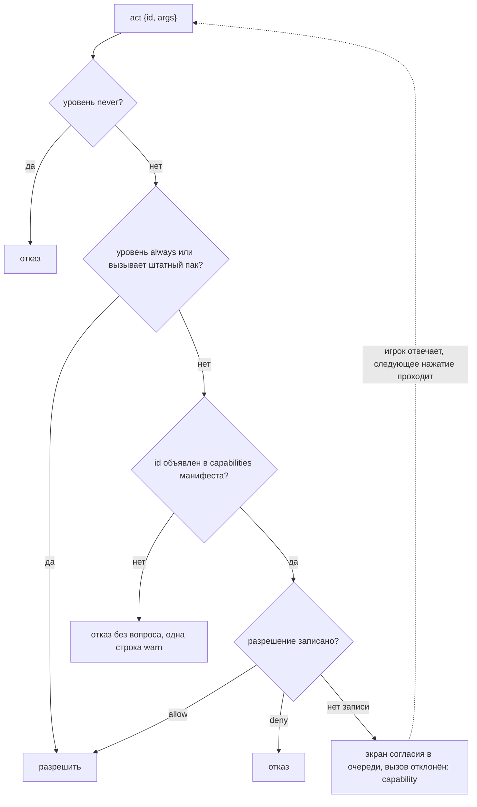

# Права

Страница — недоверенная, Java — доверенная. Поэтому вызов без разрешения отклоняется сразу, а
запрос согласия — это ванильный экран, который рисует игра, и никогда не диалог на странице: тот
же документ мог бы нарисовать поддельный.

## Уровни

| уровень | id |
|---|---|
| always | `state.sub`, `state.unsub`, `events.sub`, `events.unsub`, `open`, `skin.act`, `loading.act`, `hud.rects`, `menu.rects`, `store.get`, `store.set`, `store.remove`, `res.need`, `res.lang`, `sound.ui`, `sound.play`, `sound.stop`, `music.set`, `music.vanilla`, `server.act`, `media.probe`, `media.report`, восемь `pack.file.*` |
| ask | `quit`, `world.play`, `server.join`, `link.open`, `sound.any`, `pack.activate`, `options.write`, `game.command`, `game.chat`, `server:data`, `files` и его восемь id, `process.exec` |
| never | `files:read`, `files:write`, `net:fetch`, `net:ws` |

Уровню always не нужны ни запись в манифесте, ни разрешение. Never отклоняется всегда, а манифест,
где такое право указано, не проходит проверку. Id, на который не претендует ни один уровень,
считается ask, так что действие, которое мод зарегистрирует позже, по умолчанию закрыто; мод может
объявить уровень и описание для своих id, см. [Моды-аддоны](/ru/fv-ui/addons-java).

Моды объявляют свои id со своим уровнем и своей строкой для экрана согласия, и M12 добавил
тридцать таких; уровень каждого указан в таблице в главе [Темы и действия](/ru/fv-ui/topics-actions). Среди них ask: `clipboard.write`, `input.keybind`,
`resourcepacks.set`, `resourcepacks.reload`, `world.last`, `world.leave` и четыре
`hud.marker.*`. `options.write` и `game.chat` — id ядра, и они уже работают: первый принимает
только десять ванильных имён настроек из главы [Темы и действия](/ru/fv-ui/topics-actions) и отклоняет все остальные, второй отклоняет
команду, перевод строки и всё длиннее 256 символов.

У `link.open` и `game.command` остаются оба барьера: разрешение пака и собственный экран
подтверждения (или путь выполнения команды) ванильной игры — при каждом вызове.

## Семейства

`files.list`, `files.read`, `files.write`, `files.append`, `files.delete`, `files.mkdir`,
`files.exists` и `files.stat` отвечают как одно семейство. Манифест объявляет `files` один раз,
один экран согласия называет корень и набор операций, и одно разрешение покрывает все восемь.
Объявить отдельный id тоже можно; разрешение всё равно хранится под именем семейства. Других
семейств пока нет.

## Проверка

По порядку, для каждого вызова `act`:

1. never => отказ.
2. always, либо вызывает штатный пак (он лежит внутри jar и доверен так же, как мод вокруг
   него) => разрешить.
3. id нет в списке `capabilities` манифеста (или его семейства, или, для `process.exec`, среди
   объявленных команд) => отказ без вопроса, одна строка warn на пару пака и id.
4. разрешение под ключом семейства: разрешить, отказать, а если записи нет — поставить экран
   согласия в очередь и отклонить этот вызов. `process.exec` спрашивает сам за себя, потому что
   экран должен назвать командную строку, которую несёт вызов.



Из-за шага 3 право уровня ask обязательно нужно объявлять. Пак, который об этом забыл, видит отказ
вообще без запроса, и лог говорит об этом прямо:

```txt
fvui: pack example asked for quit, which is not declared in its manifest
```

`sound.play` изнутри проходит ту же проверку второй раз: id вне белого списка звуков интерфейса
требует `sound.any`. Собственный звук пака `fvui:pack.<pack id>.<name>` — исключение, как и его
файлы, и его хранилище: это данные самого пака, а не игры.

## Сторона страницы

Вызов отклоняется с `{code: "capability"}`, а страница продолжает работать. Вызов моста никогда не
удерживается открытым на время показа экрана, поэтому ничего не истекает по таймауту и ни один
промис не теряется. Игрок отвечает, и следующее нажатие проходит.

```js
const gated = (id, args) => fvui.call('act', { id, args }).catch((e) => {
  if (e.code !== 'capability') throw e;
  document.getElementById('status').textContent = 'waiting for permission: ' + id;
});

document.getElementById('quit').addEventListener('click', () => gated('quit'));
```

Тема `pack` несёт `capabilities` (объявленные) и `granted` (разрешённые прямо сейчас), так что
страница может показать своё состояние прав, не гадая.

## Экран согласия

Одно право одного пака на экран, с кнопками Allow, Deny и Always allow. Allow и Deny действуют до
конца сессии, Always allow записывается в `packs.json`, Esc — это отказ. Запросы встают в очередь
и разбираются из клиентского тика, так что несколько идут один за другим, а запрос во время
загрузки модов ждёт первого экрана.

Экран показывает имя и id пака, предложение с описанием права и под ним сам id. Перестилизовать
его пак не может: `ConsentScreen` входит в список never правил скинов.

<DemoCaps />

## Файл разрешений

`<gamedir>/fvui/packs.json` — тот же файл, где хранится выбор активного пака; пишется через
временный файл и атомарное перемещение:

```json
{
  "active": {"menu": "example"},
  "disabled": {"crashy": "1f4a2b0c"},
  "grants": {
    "example": {"hash": "93e60c8d", "allow": ["quit"], "deny": []}
  },
  "servers": {
    "9f2a1c4d5e6b7a80": {"address": "play.example.com", "packId": "serverui",
                         "digest": "0011223344556677-1f4a2b0c", "allowed": true,
                         "authors": ["the server owner"], "license": "MIT",
                         "capabilities": ["state.sub", "server:data"]}
  },
  "trustedServers": []
}
```

`hash` считается по списку `capabilities` манифеста. Обновление пака с тем же набором сохраняет
разрешения, выросший набор спрашивает только про новые записи, а уменьшившийся теряет разрешения,
которые больше не объявлены. Разрешения привязаны к id пака, а не к имени вида.

`servers` — это ответ по каждому серверу для пака, который прислал сервер; ключ — id сервера и
дайджест его манифеста с отсортированным списком прав: согласие там даётся один раз на сервер, а
не на каждое право. `trustedServers` игрок правит руками, игра его никогда не пишет; у сервера из
этого списка пак ограничивается разрешениями, как локальный, а не серверным белым списком. И то и
другое — в главе [Серверы](/ru/fv-ui/server).

## Файлы

`pack.file.*` — это собственные данные пака в `fvui_data/<pack id>/files/`, и они разрешены
всегда, по тому же правилу, что его хранилище и его звуки. `files.*` — это папка игры, и это ask.
Оба отказывают ещё до любого запроса, с кодом `bad-args`, если путь абсолютный, содержит `..` или
`.`, проходит через симлинк или попадает в список запретов. Лимиты — в главе [Темы и действия](/ru/fv-ui/topics-actions).

Список запретов `files.*`, на чтение и запись:

| что | почему |
|---|---|
| `mods/`, `config/`, `libraries/`, `versions/` | записанный туда файл — это код или настройки, которые выполнит следующий запуск |
| `saves/`, `logs/`, `crash-reports/` | миры и отчёты игрока |
| `fvui/`, `.fvui/`, `fvui_data/` | собственные решения fvui о доверии, кэши и данные других паков |
| `options.txt`, `optionsof.txt`, `optionsshaders.txt`, `servers.dat`, `usercache.json`, `usernamecache.json`, `launcher_profiles.json`, `realms_persistence.json`, `session.lock` | настройки игры и файлы аккаунта |
| `.jar`, `.exe`, `.dll`, `.so`, `.dylib`, `.bat`, `.cmd`, `.sh`, `.ps1`, `.msi`, `.scr`, `.com` | только запись: пак не может положить код туда, где что-то его запустит |

Удаление и запись поверх уже существующего файла спрашивают ещё раз — когда это впервые
происходит у пака, с указанием пути. Ответ на этом втором экране действует до конца сессии и
никогда не записывается, так что после перезапуска спросят снова. Пока он ждёт, вызов отклоняется
с `{code: "confirm"}` — точно так же, как при отсутствии разрешения: страница считает это «ещё
нет», и следующее нажатие проходит.

`"files": false` в `fvui/editor.json` закрывает всё семейство одной строкой в логе. Это настройка
модпака, и игрок не может её обойти своим разрешением.

## Запуск программы

`process.exec` — действие уровня ask; это решение владельца от 2026-09-15, к которому вернутся
перед релизом. Для пака, присланного сервером, оно выключено на любом уровне доверия, включая
`trustedServers`.

Пак объявляет каждую команду, которую может запустить, в блоке `capabilities` манифеста:

```txt
"capabilities": [
  "process.exec:open-folder=xdg-open *",
  "process.exec:stamp=echo fvui-m12b *"
]
```

Одна запись на команду: `process.exec:<name>=<program> <arg>...`. Имя — `[a-z0-9-]`, до 32
символов. Аргумент `*` совпадает с одним аргументом, который подставляет страница, каждый другой
токен должен совпадать сам с собой, и число аргументов входит в совпадение. Не больше 16 команд
и по 16 аргументов в каждой.

Вызов сначала сверяется с этим списком. Всё, чего в нём нет, отклоняется с `bad-args`, пишется в
лог и никогда не показывается игроку: экран согласия спрашивает только о командах, которые
объявил автор. Совпавший вызов идёт через экран согласия для exec, который показывает программу,
её аргументы, рабочий каталог и весь объявленный список, потому что ответ покрывает список.
Разрешение хранится как `process.exec@<hash of the declared list>`, так что изменение списка
спрашивает заново.

Оболочки нет. Список аргументов передаётся процессу как есть, поэтому кавычки, подстановки и `;`
никем не интерпретируются. `cwd` по умолчанию — каталог игры и проверяется тем же списком
запретов, что и `files.*`. Вывод ограничен 64 KiB, таймаут — 60 с, по умолчанию 10 с. Каждый вызов
пишется в лог с id пака, объявленным именем и полной командной строкой.

Закрывают его три переключателя, и любого из них достаточно:

| переключатель | где | по умолчанию |
|---|---|---|
| `"process": false` | `fvui/editor.json`, замок модпака | открыто |
| `"allowProcessExec": false` | `config/fvui-client.json`, политика клиента | открыто, пишется при первом запуске |
| пак не объявляет ни одной команды | его манифест | закрыто |

## Медиа

`media.probe` и `media.report` разрешены всегда: они не несут никаких данных игрока, только то,
что сборка умеет воспроизводить, и то, что делают медиаэлементы самого документа. Может ли вообще
что-то играть — это `media.available`, [Матрица поддержки Servo](/ru/fv-ui/servo).

## Практические правила для пака

- Объявляйте только то, что страница действительно вызывает. Каждая лишняя запись — ещё один
  запрос, который увидит игрок.
- Никогда не блокируйте интерфейс на закрытом вызове. Считайте `capability` ответом «ещё нет» и
  продолжайте рисовать.
- Не прячьте нужное действие за экраном загрузки: там нет экрана, на котором можно спросить, и
  запрос ждёт до титула.
- Чтение бесплатно. `state.sub`, хранилище, `res.need` и `res.lang` никогда не спрашивают.
