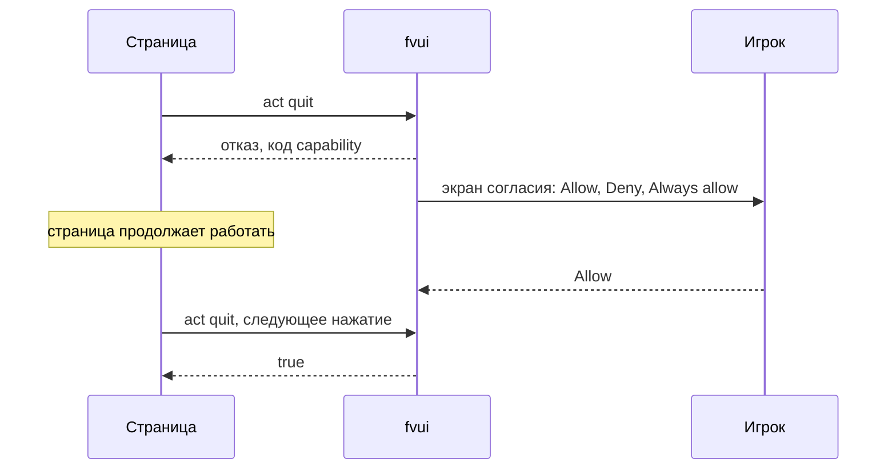

# FV-UI

`fv-ui-0.1.0.jar` — это библиотека: Servo в игре, мост между страницей и Java, формат паков,
модель прав и SDK для авторов. Она нужна и FV-Menu, и FV-Hud.

| часть | где | что это |
|---|---|---|
| `fvui-servo` | `native/` | Rust cdylib: встроенный Servo 0.5, JNI API, протокол `fvui://`, JS-мост |
| `fvui` | `mods/core` | мод NeoForge 1.21.1: загрузчик нативной библиотеки, `Engine`, `WebView`, `WebScreen`, `FvUiApi` |
| `@fvui/sdk` | `web/sdk` | мост с типами, кэшем тем, хранилищем пака, темой и моком для браузера, плюс `@fvui/vue`, `@fvui/svelte` и `@fvui/react` |
| шаблоны | `templates/` | заготовки паков на vue, svelte, react и без фреймворка, плюс `addon-java` |

## Мост

Игра отдаёт один скрипт, и страница загружает его первым:

```html
<script src="fvui://bridge/bridge.js"></script>
```

```js
fvui.call(method, args)   // один вызов моста, возвращает Promise
fvui.on(name, cb)         // упорядоченные события, например "mode"
fvui.state(key, cb)       // текущее значение темы и каждое следующее
```

Мост отвечает только страницам с `fvui://` или с origin из списка разрешённых.
Полное описание: [Мост](/ru/fv-ui/bridge).

## Темы и действия

Данные игры читаются как **темы** (topics): `title.state`, `worlds`, `servers`, `options.prefs`,
`pack`, `gui.scale` и так далее. Значение приходит при изменении, а считается, только пока на тему
кто-то подписан, — поэтому нет ни опроса, ни кэшей.

Всё, что страница делает с игрой, идёт одним вызовом:

```js
await fvui.call('act', { id: 'open', args: { screen: 'options' } })
```

Все идентификаторы с их данными: [Темы и действия](/ru/fv-ui/topics-actions).

## Права

Страница — недоверенная, Java — доверенная. Согласие спрашивает ванильный экран, который рисует
сама игра, а не диалог на странице: тот же документ мог бы нарисовать поддельный. Пока игрок
думает, вызов сразу отклоняется с кодом `capability`, а страница продолжает работать.



| уровень | смысл | примеры |
|---|---|---|
| <span class="tier always">always</span> | без записи в манифесте и без согласия | `state.sub`, `open`, `skin.act`, `store.get`, `store.set`, `res.need`, `res.lang`, `sound.play`, `music.set` |
| <span class="tier ask">ask</span> | указано в манифесте, игрок отвечает один раз | `quit`, `world.play`, `server.join`, `link.open`, `pack.activate`, `options.write`, `game.command`, `files` |
| <span class="tier never">never</span> | пак с таким правом не загрузится | `files:read`, `files:write`, `net:fetch`, `net:ws` |

<DemoCaps />

Подробности, семейства прав и файл выданных разрешений: [Права](/ru/fv-ui/capabilities).

## Паки

Пак — это папка или zip в `<gamedir>/fvui/packs/`. Самый маленький полный пак — три файла:

```json
{
  "id": "example",
  "version": "1.0.0",
  "name": "Example Pack",
  "fvui": ">=0.1.0",
  "entries": { "title": "index.html" },
  "theme": "theme.css",
  "capabilities": ["state.sub", "open", "store.get", "store.set", "quit"]
}
```

- Чего в паке нет, берётся из штатного, экран за экраном. Пак из одного `theme.css` перекрашивает
  штатные экраны.
- Данные пака лежат в `fvui_data/<id>/store.json`, вне `config/`, поэтому обновление модпака их
  не стирает.
- Текстуры и переводы игры запрашиваются через `res.need` и `res.lang` и приходят с `fvui://res/` —
  с учётом ресурспака игрока.
- Страница, упавшая при загрузке, отключает свой пак до изменения манифеста, а вид возвращается к
  штатному паку.

Формат: [Формат пака](/ru/fv-ui/packs). Первый пак: [Быстрый старт](/ru/fv-ui/quick-start).

## Шаблоны

| шаблон | стек | размер страницы |
|---|---|---|
| `templates/vanilla` | ES-модули, без сборщика | 17 kB |
| `templates/svelte` | Svelte 5, Vite | 48 kB |
| `templates/vue` | Vue 3, Vite | 73 kB |
| `templates/react` | React 19, Vite | 232 kB |

Замер 14.09.2026, без сжатия. Каждый шаблон — полный пак: титул, страница загрузки и скин экрана.
Пакеты `@fvui/*` пока не в npm, см. [JS SDK](/ru/fv-ui/sdk).

## Servo — не Chromium

Servo 0.5 — современный движок с дырами в конкретных местах, и дыры молчаливые: неподдержанное
свойство разбирается и ничего не делает.

| работает | не работает |
|---|---|
| CSS grid и flexbox, `:is()`, `:where()`, вложенность через `&` | `:has()`, `@container` |
| `@font-face`, media queries | `backdrop-filter`, `mask-image`, `text-overflow` |
| custom elements, shadow DOM, ES2022, `fetch` по `fvui://` | `user-select`, `appearance` |
| Resize-, Intersection- и MutationObserver, WebGL2 | grid и flex на настоящем `<button>` |

Полный набор правил: [Матрица поддержки Servo](/ru/fv-ui/servo).

## Для Java-модов и серверов

Через `FvUiApi` другой мод регистрирует свои темы и действия, и любой пак может их читать и
вызывать: [Моды-аддоны](/ru/fv-ui/addons-java). Серверы общаются с паками по каналу `fvui:data`
и могут присылать паки с согласия игрока: [Серверы](/ru/fv-ui/server).
