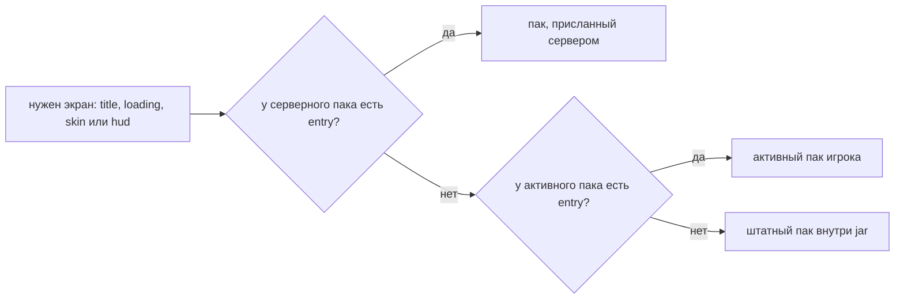
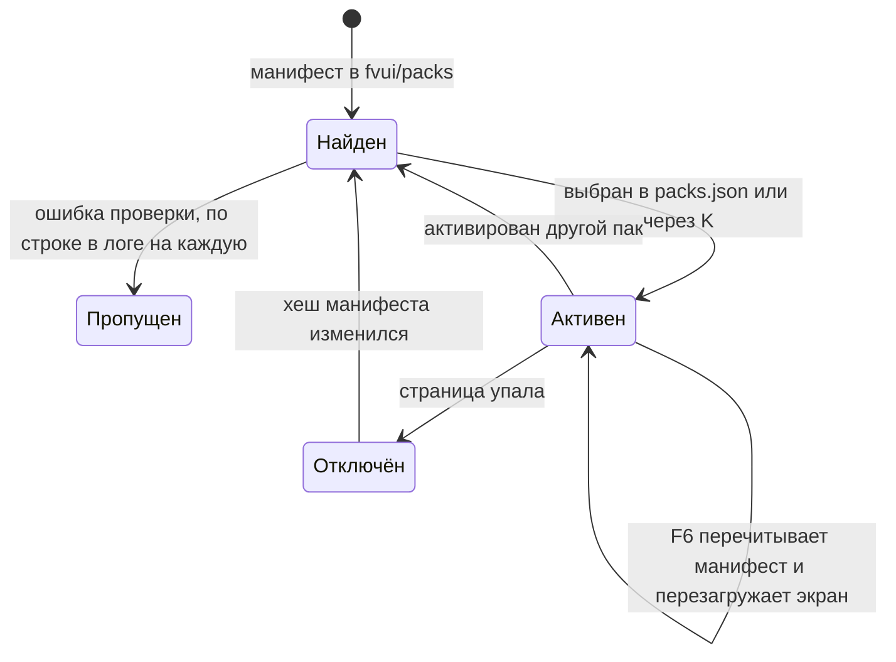

# Паки

Пак — это папка с файлом `fvui.pack.json` в корне. Всё остальное необязательно. Штатное меню —
тоже пак, он лежит внутри `fv-menu.jar` и служит запасным вариантом для каждого экрана, который
не занял пак игрока.

## Манифест

```json
{
  "id": "example",
  "version": "1.0.0",
  "name": "Example Pack",
  "authors": ["fatevis"],
  "license": "MIT",
  "description": "One line for the picker.",
  "fvui": ">=0.1.0",
  "entries": {"title": "index.html"},
  "theme": "theme.css",
  "backdrop": {"image": "art/back.png", "loading": "art/loading.png"},
  "capabilities": ["state.sub", "open", "quit"],
  "skins": {"include": [], "exclude": [], "modScreens": false},
  "res": ["minecraft/textures/block/grass_block_side.png"],
  "sounds": {"click": "sounds/click.ogg"}
}
```

| поле | правило |
|---|---|
| `id` | подходит под `[a-z0-9_-]{3,64}` и совпадает с именем папки |
| `version` | `\d+(\.\d+)*` с необязательным суффиксом, также записывается в файл хранилища пака |
| `name` | показывается на экране согласия и в выборе пака |
| `authors` | список строк |
| `license` | свободный текст |
| `description` | одна строка |
| `fvui` | диапазон версий: `>=0.1.0`, `<=0.2`, `0.1.0` или maven-диапазон `[0.1.0,0.2)` |
| `entries` | экран → файл; экраны — `title`, `loading`, `skin` и `hud` |
| `theme` | один CSS-файл с переопределением токенов |
| `backdrop` | изображения `--backdrop-*`; строка — короткая форма одного изображения на все четыре |
| `capabilities` | что пак может запрашивать, [Права](/ru/fv-ui/capabilities) |
| `skins` | сливается под `config/fvmenu-skins.json`, файл конфига важнее |
| `res` | пути ресурсов игры, которые извлекаются в `fvui://res/` до первого кадра |
| `sounds` | ogg-файлы пака по именам звуков, см. «Звуки пака» |

Обязательны `id`, `version` и что-то одно из: entry, тема или backdrop. Пак только с темой или
только с backdrop допустим и перекрашивает штатные страницы.

`hud` зарезервирован как четвёртый экран и появляется вместе с видом HUD.

Проверка — одна строка в логе на каждую проблему, после чего пак пропускается. Проверяется:
манифест разбирается, шаблон id и имя папки, версия, диапазон `fvui` против установленной версии
мода, известные экраны, каждый entry и файл темы существуют внутри корня пака и не выходят из
него, каждое право известно и не запрещено, каждое имя звука допустимо и его ogg на месте.

`docs/dk/fvui.pack.schema.json` — та же форма в виде JSON-схемы, для редактора или шага сборки.
В одном она строже игры: неизвестное поле там ошибка, а Gson его просто отбрасывает.
`node tools/check-dk.mjs` проверяет по ней все манифесты в этом дереве.

## Где живёт пак

Для каждого id побеждает первое совпадение:

```txt
-Dfvui.dev.pack=<dir>              dev override, wins over packs.json
<gamedir>/fvui/packs/<id>/         directory pack
<gamedir>/fvui/packs/<id>.zip      zip pack
the default pack inside fv-menu.jar
```

Zip распаковывается один раз на сборку архива в `<gamedir>/.fvui/cache/packs/<id>-<size>-<mtime>/`,
потому что нативная сторона отдаёт только обычные файлы. Папка важнее zip с тем же id.

## Какой пак активен

`<gamedir>/fvui/packs.json`:

```json
{"active": {"menu": "example"}, "disabled": {}, "grants": {}}
```

Один активный пак на вид, а не на экран: меню — это один документ, который переключает режимы.
Файл лежит в `fvui/`, а не в `config/`, который перезаписывает обновление модпака. Неизвестный,
непрошедший проверку или отключённый id даёт одну строку warn, и вид остаётся на штатном паке.



Запасной вариант работает по каждому entry отдельно. Пак, объявивший только `entries.title`,
сохраняет штатную страницу загрузки и штатные скины экранов.

## Хосты

| url | что отдаёт |
|---|---|
| `fvui://menu/` | корень активного пака вида меню |
| `fvui://ui/` | корень штатного пака, запасной вариант для недостающих entry |
| `fvui://res/` | кэш ресурсов игры |
| `fvui://saves/` | папка сохранений, для иконок миров |
| `fvui://bridge/bridge.js` | скрипт моста |

Поэтому страница пака ссылается на свои файлы относительно, а файловый хост не шлёт заголовков
кэширования.

## Ресурсы

Текстуры игры со страницы не читаются, поэтому их нужно запросить:

```js
const need = await fvui.call('act', {id: 'res.need', args: {paths: ['minecraft/textures/block/dirt.png']}});
document.querySelector('img').src = need.urls['minecraft/textures/block/dirt.png'];
```

Ответ — `{epoch, urls}`. Путь, которого нет или который выходит из кэша, не попадает в `urls` и
один раз пишется в лог. Список `res` из манифеста извлекается до первого кадра, всё более позднее
покрывает `res.need`. Пути имеют вид `<namespace>/<path>`.

Каждый url несёт `?v=<epoch>`. Перезагрузка ресурсов пишет новую папку эпохи, перерегистрирует
хост и отправляет тему `res.epoch`, а `?v=` заставляет движок перечитать файл: следите за этой
темой и пересобирайте адреса.

Переводы идут мимо кэша: таблица заняла бы мегабайты:

```js
const lang = await fvui.call('act', {id: 'res.lang', args: {keys: ['menu.options']}});
// or {prefix: 'options.'} , at least two characters or the call fails with bad-args
```

## Звуки пака

Пак может нести собственные ogg-файлы и проигрывать их через `sound.play` и `music.set`:

```txt
"sounds": {
  "click": "sounds/click.ogg",
  "menu": {"file": "sounds/menu.ogg", "stream": true, "subtitle": "example.menu"}
}
```

Строка — короткая форма `{"file": ...}`. Тот же блок может лежать в `sounds.json` рядом с
манифестом; записи из манифеста важнее. Имена подходят под `[a-z0-9_.-]{1,64}`, файл должен
оканчиваться на `.ogg` и лежать внутри пака, а отсутствующий файл — такая же ошибка проверки, как
любая другая.

Id имеет вид `fvui:pack.<pack id>.<name>`, так что манифест выше даёт
`fvui:pack.example.click` и `fvui:pack.example.menu`. Id разнесены по пакам, поэтому два пака не
могут столкнуться, и пак может играть свои звуки без разрешения `sound.any`: это его собственные
данные. `stream` нужен всему, что длиннее нескольких секунд, и прежде всего музыке.

```js
await fvui.call('act', {id: 'music.set', args: {id: 'fvui:pack.example.menu', loop: true}});
```

Громкость, как всегда, следует категории: `music.set` — на ползунке MUSIC, `sound.play` по
умолчанию MASTER и принимает `category`.

Игра читает эти файлы из скрытого ресурспака, который fvui добавляет в репозиторий паков клиента;
он собирается при перезагрузке этого репозитория. Поэтому паку, у которого появился или пропал
звук, нужна перезагрузка ресурсов (F3+T), а не только горячая перезагрузка пака по F6; сами же
ogg-файлы читаются с диска при каждом воспроизведении, так что для замены файла не нужно ни того,
ни другого.

## Хранилище пака

`<gamedir>/fvui_data/<pack id>/store.json` — одно пространство имён на пак, вне `config/` и вне
самого пака, так что ни обновление пака, ни обновление модпака не стирает данные игрока.

```js
await fvui.call('act', {id: 'store.set', args: {key: 'example.runs', value: 3}});
const dump = await fvui.call('act', {id: 'store.get'});   // {version, data}
const one = await fvui.call('act', {id: 'store.get', args: {key: 'example.runs'}});
```

`version` — версия пака, которая последней писала файл. Она меняется только при следующей записи,
так что после обновления пака страница один раз видит старую, мигрирует то, что понимает, и
записывает. Java никогда не интерпретирует данные пака, и хука миграции нет.

Лимиты (отказ с `{code: "limit"}` и одной строкой warn, файл не меняется): 16 KB на значение,
256 KB на файл, 512 ключей, 128 символов на ключ. Записи сбрасываются на диск через 2 с после
последнего изменения, при закрытии экрана и при выходе из игры — всегда через временный файл и
атомарное перемещение.

Ключи, которые читают штатные страницы: `ui.theme` (`default`, `high-contrast`, `vanilla` или `auto`),
`ui.choiceControl` (`auto`, `dropdown`, `cycle`), `ui.hoverSound`, `ui.showcaseQuality` (`off`,
`low`, `high`) и `ui.reducedMotion` (`auto`, `on`, `off`), плюс `ui.serverView` ряда карточек
(`list` или `cards`) и `ui.serverSort` (`list`, `tier`, `joined`, `name`, `ping`) — [Карточки серверов](/ru/fv-menu/server-cards).
Штатная страница показывает их все строками в панели пака, которую на титуле открывает K.

## Тема

`theme.css` — обычный CSS без слоёв. Пресеты штатной страницы лежат в CSS-слое, поэтому блок
`:root` вне слоя побеждает их все, не подгоняя специфичность. Файл из четырёх строк — уже
настоящая тема.

```txt
:root { --glow: #ffb347; --paper: #f2efe6; --sans: "Geologica", sans-serif; --text: 16px; }
```

<DemoTheme />

| токен | вид | что красит |
|---|---|---|
| `--ink` | `R, G, B` | основа страницы, используется с разной прозрачностью как `rgba(var(--ink), 0.8)` |
| `--panel` | `R, G, B` | приподнятые плашки: карточки, заливка при наведении |
| `--pop` | `R, G, B` | всплывающие слои над ними: тело выпадающего списка |
| `--paper` | цвет | основной текст и яркие заливки |
| `--dim` | цвет | вторичный текст |
| `--faint` | цвет | волосяные линии и контуры элементов |
| `--glow` | цвет | акцент: фокус, ползунки, главная кнопка |
| `--rim` | цвет | освещённый пиксельный кант плашки, сверху и слева |
| `--bevel` | цвет | пиксель фаски под кантом |
| `--sunk` | цвет | самое глубокое углубление: дорожки прокрутки, поля |
| `--ok` | цвет | положительное состояние |
| `--bad` | цвет | отрицательное состояние |
| `--sans` | стек шрифтов | заголовки и основной текст |
| `--mono` | стек шрифтов | подписи, числа, клавиши |
| `--text` | длина | базовый размер шрифта |
| `--ease` | кривая | общая кривая переходов |
| `--photo` | 0..1 | насколько просвечивает фоновое фото |
| `--pixel` | `auto` или `pixelated` | `image-rendering` для фото |
| `--shade` | 0..1 | насколько меню в игре затемняет мир, 0 не трогает его |
| `--backdrop-sharp` | `url(...)` | фон меню при размытии 0 |
| `--backdrop-blur5` | `url(...)` | то же фото при Menu Background Blur 5 |
| `--backdrop-blur10` | `url(...)` | то же фото при размытии 10 |
| `--backdrop-loading` | `url(...)` | фон страницы загрузки |

Три токена поверхностей — тройки `R, G, B`, потому что они смешиваются с разной прозрачностью.
Цвета содержимого — полные CSS-цвета, а их прозрачные варианты используют
`color-mix(in srgb, var(--glow) 10%, transparent)`, что в servo 0.5 работает.

Четыре токена `--backdrop-*` — та половина фона, которой файл темы может владеть сам: он
отдаётся с хоста пака, поэтому относительный `url(art/x.png)` в нём разрешается относительно
пака, и четырёх строк CSS хватает, чтобы заменить штатные фото. `backdrop` в манифесте — вторая
половина, для первого кадра и для пака вообще без файла темы; он не важнее файла темы, он просто
применяется раньше и переприменяется при смене пака без перезагрузки.

Доставка: игра добавляет к адресу страницы `preset=<id>`, `theme=<url>`, если манифест его
объявляет, и по одному `backdrop-<slot>=<url>` на каждое объявленное фоновое изображение, так что
уже первый кадр оформлен. Страница пака, которая заменяет экран, подключает свой
файл сама. Паку, который объявил только `theme` и ни одного entry, файл всё равно применяется к
штатным страницам, потому что у пака остаётся свой хост.

Пресет и токены фона также едут в теме `theme` как `{preset, vars}`, так что смена High Contrast
или пака перекрашивает без перезагрузки.

Без темы: копия страницы загрузки в раннем окне — это нативная Java, и ничего из этого она не
читает, так что пак, перекрашивающий загрузку, всё равно отличается от первой секунды запуска.

## Оформление контейнеров и HUD

Контейнеры, подсказки, тосты, таб-лист, строка ввода чата и рамка боссбара рисуются из пиксельных
спрайтов, а не плоской заливкой токеном: один жёсткий контур, освещённый кант сверху и слева,
тень снизу и справа, затем тело. Листы спрайтов лежат по пресетам в
`fvui://hud/chrome/<preset>/`; `--rim`, `--bevel` и `--sunk` — токены, которые читает CSS-половина
этого вида, так что файл темы по-прежнему двигает волосяные линии, подписи и акцент вместе с ним.

Хотбар, сердца, броня, еда, воздух, полоса опыта, иконки эффектов и сам спрайт боссбара остаются
ванильными, пиксель в пиксель. Ничто из файла темы их не двигает.

Ключ хранилища пака `ui.chrome` выбирает, откуда берутся спрайты:

| значение | эффект |
|---|---|
| `page` | мои листы, по умолчанию |
| `pack` | ресурспак игрока, читается с `fvui://res/` |
| `flat` | без спрайтов, простая заливка токеном |

В режиме `pack` каждая деталь — ванильный GUI-спрайт, который ресурспак и так может переопределить, -
`popup/background`, `widget/button`, `widget/tab`, `widget/tab_selected`, `widget/text_field`,
`widget/scroller_background`, `widget/scroller`, `container/bundle/background`, `container/slot` -
а её nine-slice рамка берётся из собственного `.png.mcmeta` этого спрайта. Поэтому GUI-пак
перекрашивает наше оформление вообще без нашего пака. Два ограничения: части рамки растягиваются
там, где ваниль замощает, что заметно только на канте с узором, и для рамки боссбара ванильного
спрайта нет, так что в этом режиме её нет.

## Жизненный цикл

| клавиша | эффект |
|---|---|
| F6 | на любом экране перечитывает все манифесты с диска и заново загружает текущий экран |
| K | на штатной титульной странице — выбор пака |



F6 — это цикл автора: поправил файл, нажал F6, без перезапуска и без второго движка. Перезагрузка
увеличивает поколение, которое едет в адресе страницы как `&r=<n>`, потому что файловые хосты не
шлют заголовков кэширования и тот же адрес мог бы отдать движку документ только что покинутого
пака. Файлы, на которые страница ссылается относительно, этим не сбрасываются, поэтому страница
добавляет этот `r` к своим ссылкам сама:

```html
<script>
  const bust = new URLSearchParams(location.search).get('r') || '0';
  document.head.insertAdjacentHTML('beforeend', '<link rel="stylesheet" href="theme.css?r=' + bust + '">');
</script>
```

`pack.activate {id}` переключает пак на лету, пишет `active` в `packs.json` и перезагружает. Это
право уровня ask, так что штатный пак переключает без вопросов (он доверенный), а любому другому
нужно разрешение — в том числе на возврат к штатному.

Упавшая страница отправляет свой пак в раздел `disabled` файла `packs.json` с ключом — хешем его
`fvui.pack.json`, а вид возвращается к штатному паку. Пак вернётся сам, как только этот хеш
изменится, то есть когда автор тронет манифест.

Экран, entry которого — другой файл, чем загруженный, означает настоящую загрузку страницы, и она
стоит двух кадров ванили между старым документом и первым кадром нового. Пак, которому вспышка не
нужна, держит один файл на все экраны, как штатный пак.
