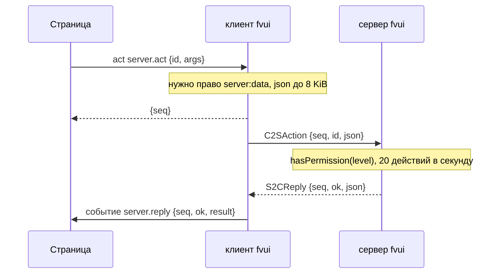

# Сервер

Один jar, один id мода, три пакета. `fv-ui` теперь не привязан к стороне: `FvUi` ветвится по
`FMLEnvironment.dist` в `fatevis.fvui.client` или, на выделенном сервере, во что-то, где не названо ни одного
клиентского класса. Сервер ставит тот же jar `fv-ui` и больше ничего; он никогда не извлекает нативную библиотеку и
никогда не пишет `.fvui/`, `fvui/` или `fvui_data/`.

```json
[modloading-worker-0/INFO] [fa.fv.FvUi/]: fvui: server side, engine not loaded
```

`fv-menu` и `fv-hud` остаются чисто клиентскими и на сервер не ставятся.

## Канал

Один канал данных, `fvui:data`, регистрируется один раз из общей для сторон точки входа с `optional()`, так что
ванильный клиент по-прежнему подключается к серверу с fvui, а клиент с fvui — к ванильному
серверу. Каждая отправка проходит через `hasChannel`, так что ванильному клиенту просто никогда ничего не пишут.

| пакет данных | направление | поля |
|---|---|---|
| `S2CHello` | клиенту | protocol, topics, actions, rateLimit, sizeCap |
| `S2CPack` | клиенту | packId, namespace, surface, digest, required |
| `S2CData` | клиенту | topic, json |
| `S2CEvent` | клиенту | channel, json |
| `C2SAction` | серверу | seq, id, json |
| `S2CReply` | клиенту | seq, ok, json |

Кодеки написаны вручную поверх обычных строк и JSON без id реестров, так что те же байты позже сможет
выдавать что-то, что не является сервером NeoForge. Пока схема не заморожена, правило такое:
поля только добавляются, без перестановок и без id реестров.

`S2CHello` и предложение пака едут в фазе play, при входе игрока, а не задачей конфигурации.
Клиент всё равно принимает решение до своего первого кадра HUD, а медленный ответ не может подвесить вход.

## Темы

Серверное значение попадает в канал состояния под именем `server.data.<name>`. Просто `server.` уже был
занят — `server.address` это тема fvmenu, а `server.join` действие, — поэтому зарезервирован только `server.data.`,
и вся резервация — это проверка в `FvUiApi.push`, `pushTo` и `topic`: эти map
плоские и собственного предупреждения о коллизиях не имеют.

| тема | владелец | вид | данные |
|---|---|---|---|
| `server.channel` | core | push | `{protocol, topics, actions, rateLimit, sizeCap}`, null без канала |
| `server.data.motd` | core | tick | сообщение, которое показывает сервер, строка |
| `server.data.players` | core | tick | имена игроков, отсортированы |
| `server.data.tick` | core | tick | `{count, ms}` |

Всё сверх этих трёх приходит из аддона. Страница читает их как любую другую тему:

```js
const v = await fvui.call('state.sub', { topics: ['server.data.motd'] })
```

## Действия

До серверного действия страница добирается через одно клиентское действие, потому что вызов моста синхронный, а
ответ сервера — нет:

| действие | аргументы | результат | уровень |
|---|---|---|---|
| `server.act` | `{id, args}` | `{seq}` | always |

Ответ приходит упорядоченным событием `server.reply` в виде `{seq, ok, result}`. При отказе `result` —
это `{code, message}`, где `code` один из `limit`, `rate`, `unknown`, `denied`, `off`.



```js
fvui.call('events.sub', { events: ['server.reply'] })
fvui.on('server.reply', r => console.log(r.seq, r.ok, r.result))
const { seq } = await fvui.call('act', { id: 'server.act', args: { id: 'ping', args: {} } })
```

| действие | уровень | что делает |
|---|---|---|
| `ping` | 0 | `{pong, name, tick}` |
| `motd.set` | 2 | задаёт то, что несёт `server.data.motd` |

## Два барьера, пройти нужно оба

Страница: новое право уровня ask, `server:data`. Без него пак не может подписаться на
тему `server.data.*` и вообще не может вызвать `server.act`. Сам `server.act` разрешён всегда, так что
диспетчер его пропускает, а настоящий барьер стоит внутри него — та же форма, что уже есть у `sound.play` и
`sound.any`.

Игрок: каждый id действия регистрируется через
`FvUiServerApi.action(id, handler, level, about)` с уровнем команд, незарегистрированный id отклоняется
с `unknown`, а проверка — это `player.createCommandSourceStack().hasPermission(level)`, так что
мод прав, который патчит этот путь, действует без ведома fvui.

`net:fetch` и `net:ws` по-прежнему не разрешаются никогда. Этот канал — именованные темы и зарегистрированные действия, а не
сокет, так что правило из главы [Права](/ru/fv-ui/capabilities) соблюдается.

## Лимиты

| лимит | значение | при превышении |
|---|---|---|
| json действия | 8 KiB | отказ с `limit`, сначала на стороне клиента |
| json темы | 64 KiB | отбрасывается на сервере, одна строка warn на тему за 5 с |
| на игрока | 256 KiB в секунду | отбрасывается до следующей секунды |
| действия | 20 в секунду, всплеск 40 | отказ с `rate` |
| пакеты данных | 32 за тик на игрока | отбрасываются самые старые |

От сервера к клиенту склеивается последнее значение по каждой теме за тик; события сохраняют порядок и идут первыми.
`/fvui debug <player>` печатает счётчики: отправлено, байты, отброшено, отклонено, ограничено по частоте.

## Серверные команды

`/fvui`, регистрируется для любого набора команд, так что тестирование в одиночной игре на встроенном
сервере бесплатно.

| команда | уровень | эффект |
|---|---|---|
| `/fvui pack list` | 0 | пак, который предлагает этот сервер: id, пространство имён, экраны, обязательность |
| `/fvui pack activate <targets> <id> [surface]` | 2 | отправляет предложение этим игрокам |
| `/fvui pack reload` | 3 | перечитывает `config/fvui-server.json` и объявляет заново |
| `/fvui hud set <targets> <layer> <x> <y> <scale>` | 2 | предложение для HUD, см. ниже |
| `/fvui hud reset <targets> [layer]` | 2 | то же |
| `/fvui data <topic> <targets> <json>` | 3 | разовая отправка, хук для командных блоков и датапаков |
| `/fvui debug <target>` | 3 | счётчики канала |

`/fvui hud` — это предложение и никогда не тихая запись: клиент применяет его, только когда
в `fvui/hud.json` задано `"serverHud": true` (так и есть по умолчанию), а игрок, который это выключил,
получает одну строку в чате о том, что сервер пытался.

## Клиентские команды

`/fvuic`, отдельный корень. Клиентская команда затеняет серверную с тем же именем, так что два корня —
единственный способ существовать обеим. Ничто в этих обработчиках не трогает сервер.

| команда | эффект |
|---|---|
| `/fvuic pack list` | пак, на котором работает каждый вид, плюс серверный пак, если он есть |
| `/fvuic pack activate <id>` | переключить все виды на этот пак |
| `/fvuic pack reload` | перезагрузка F6 из чата — для пака, сломавшего собственную страницу |
| `/fvuic engine` | платформа, найденная нативная библиотека, загружена или нет |
| `/fvuic server` | канал, который предлагает этот сервер |

## UI-паки, которые присылает сервер

Сервер отдаёт UI-пак внутри своего обычного ресурспака. Второго транспорта и HTTP-клиента
в моде нет: ваниль уже скачивает ресурспак, показывает свой запрос, уважает
`require-resource-pack` и монтирует его.

```html
<resource pack>.zip
  pack.mcmeta
  assets/<namespace>/fvui/pack/<id>/fvui.pack.json
  assets/<namespace>/fvui/pack/<id>/index.html
```

В `server.properties`, как обычно, нужны `resource-pack` и `resource-pack-sha1`, а
`config/fvui-server.json` называет пак и экраны:

```json
{
  "enabled": true,
  "packs": true,
  "levels": {},
  "pack": {
    "id": "serverui",
    "namespace": "fvuidemo",
    "surfaces": ["title"],
    "required": false
  }
}
```

`levels` может поднять уровень id действия, но никогда не опустить. `enabled` false выключает весь
канал, `packs` false оставляет половину с данными и прекращает предложение пака.

Клиент копирует дерево из смонтированного ресурспака в
`<gamedir>/.fvui/cache/server/<server-id>/<id>-<stamp>/`, потому что нативная сторона отдаёт обычные файлы.
`<server-id>` — это 16 hex-символов sha256 от адреса, так что ни один адрес не становится именем папки.
Извлечённое дерево больше 64 MiB или 4000 файлов отклоняется одной строкой error.

Активация — одно звено в начале поиска entry: серверный пак, затем активный пак
игрока, затем штатный пак. Экран, на который серверный пак не претендует или для которого у него нет entry, проходит
дальше нетронутым, так что правило «один пак на хост» из главы [Формат пака](/ru/fv-ui/packs) соблюдается. Выход с сервера очищает
запись, и после одной перезагрузки пак игрока возвращается. Собственный `fvui_data/<id>/store.json` пака
разнесён по id, так что при выходе ничего не теряется.

## Чего серверному паку нельзя никогда

Серверный пак никогда не считается доверенным и никогда им не становится. Ещё до проверки любых разрешений решает
фиксированный белый список — причём он работает раньше уровня, так что даже id уровня always, которого в нём нет,
отклоняется:

```txt
state.sub  state.unsub  events.sub  events.unsub
store.get  store.set  store.remove  res.need  res.lang
sound.ui  sound.play  music.set
hud.rects  menu.rects  container.rects  skin.act  loading.act
server.act  server:data
```

Отклоняются, что бы ни говорил манифест или разрешение: `quit`, `world.play`, `server.join`, `link.open`,
`options.write`, `pack.activate`, `game.command`, `game.chat`, `sound.any`, `open` и весь
уровень never. Права `files` нет вообще, и `process.exec` тоже, так что «страница сервера не может
тронуть ваши файлы» верно потому, что этих id не существует, а не потому, что они фильтруются.
`game.command` — то, что серверу и не нужно: он может выполнить команду сам.

Согласие даётся один раз на сервер, а не на каждое право. Запрос — ванильный экран, где названы
адрес, пак, его авторы и лицензия и полный список его прав; Esc — отказ, который
оставляет собственный пак игрока. Ключ ответа — id сервера плюс дайджест манифеста
и его отсортированного списка прав, так что сервер, изменивший то или другое, спросит снова. Ответ хранится в новом
блоке `servers` файла `fvui/packs.json`:

```json
{
  "active": {"menu": "example"},
  "servers": {
    "9f2a1c4d5e6b7a80": {
      "address": "play.example.com",
      "packId": "serverui",
      "digest": "0011223344556677-1f4a2b0c",
      "allowed": true,
      "authors": ["the server owner"],
      "license": "MIT",
      "capabilities": ["state.sub", "server:data"]
    }
  },
  "trustedServers": []
}
```

## trustedServers

`trustedServers` — список id серверов в `fvui/packs.json`, который игрок правит руками, а игра
никогда не пишет. Пак сервера из этого списка считается локальным: шаг белого списка
пропускается, и вместо него работает обычный порядок разрешений по каждому праву, с запросами. Это способ запускать
пак с сервера, которым вы действительно владеете, чтобы белый список не мешал. Всё остальное по-прежнему
действует, так что уровень never остаётся never.

## Как написать аддон под это

`FvUiServerApi` живёт в `fatevis.fvui.common`, поэтому аддон компилируется с ним на обеих сторонах и
ничего не делает там, где нет канала.

```txt
FvUiServerApi.topic("shop.balance", 40, () -> economy.total());
FvUiServerApi.action("shop.buy", (player, args) -> shop.buy(player, args.get("item").getAsString()),
    Commands.LEVEL_ALL, "Buy from the server shop");
FvUiServerApi.push(player, "shop.balance", economy.of(player));
FvUiServerApi.event(player, "shop", Map.of("bought", "diamond"));
```

`topic(name, intervalTicks, sampler)` опрашивает один раз и отправляет всем в канале; значение для
конкретного игрока идёт через `push(player, name, value)` из собственной логики аддона. Имя должно состоять из
сегментов в нижнем регистре через точку, не больше 64 символов, а префикс `server.data.` добавляется за вас.

## Позже

Плагин для Paper, который шлёт те же байты по каналу plugin messaging `fvui:data`, — единственная новая
работа, которая нужна серверу не на NeoForge, и она упирается в заморозку схемы, чего M11a не делает.
Потоковая доставка пака по каналу данных — для того же случая, когда нет серверного
ресурспака, в котором можно ехать.
