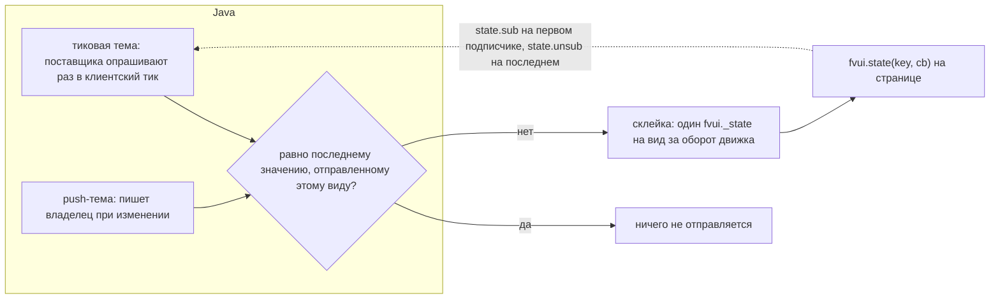

# Темы и действия

Данные игры читаются как темы, работа в игре выполняется через действия. И то и другое регистрируют моды, и
fvui никогда не называет мод, который их зарегистрировал.

## Темы {#topics}

Два вида. У тиковой темы есть поставщик, которого опрашивают раз в клиентский тик, пока подписана хотя бы одна
страница; он запускается и останавливается с первым и последним подписчиком. Push-тему пишет
тот, кто владеет данными, — когда они меняются. В обоих случаях страница видит одно и то же:

```js
fvui.call('state.sub', { topics: ['title.state', 'gui.scale'] });
fvui.state('title.state', (state) => console.log(state.player, state.splash));
```



Значения сравниваются через `equals` на стороне Java, так что неизменившееся значение ничего не стоит. Тиковые темы
не работают во время загрузки модов, потому что шина событий игры ещё не запущена: всё, что нужно странице
загрузки, отправляется через push, см. [Страница загрузки](/ru/fv-menu/loading).

| тема | владелец | вид | данные |
|---|---|---|---|
| `screen.id` | core | tick | имя класса текущего экрана или null |
| `server.channel` | core | push | `{protocol, topics, actions, rateLimit, sizeCap}`, пока сервер несёт `fvui:data`, иначе null |
| `server.data.motd` | core | tick | сообщение, которое показывает сервер. [Серверы](/ru/fv-ui/server) |
| `server.data.players` | core | tick | имена игроков на сервере, отсортированы |
| `server.data.tick` | core | tick | `{count, ms}` серверных часов |
| `gui.scale` | core | tick | `{guiScale, auto, cssScale, width, height}` |
| `dev.perf` | core | push | `{evals, bytes, keys, flushes, calls, blocked, pending}`, раз в секунду |
| `res.epoch` | core | push | целое, увеличивается при перезагрузке ресурсов |
| `font.epoch` | core | push | целое, увеличивается при перезагрузке ресурсов, см. [Экран HUD](/ru/fv-hud/hud-surface) |
| `pack` | core | push | активный пак, форма ниже |
| `packs` | core | push | список всех найденных паков, исправных и сломанных |
| `options.prefs` | fvmenu | tick | `{blur, speed, splash, contrast}` |
| `theme` | fvmenu | tick | `{preset, vars}`, preset — `default`, `high-contrast` или `vanilla` |
| `title.state` | fvmenu | push | отправляется при каждом показе титула |
| `worlds` | fvmenu | push | отправляется вместе с `title.state` |
| `player.skin` | core | push | отправляется вместе с `title.state` и ещё раз, когда завершится загрузка |
| `servers` | fvmenu | push | весь список на каждый ответ пинга |
| `servers.stats` | fvmenu | push | часы, входы и заметка по каждому серверу; отправляется при обновлении, выходе и записи заметки |
| `loading.info` | fvmenu | push | раз на фазу загрузки, [Страница загрузки](/ru/fv-menu/loading) |
| `loading.progress` | fvmenu | push | каждые 100 мс в boot, на каждый кадр рендера в остальных фазах |
| `server.address` | fvmenu | tick | `{address, name, lan, singleplayer}`, null в одиночной игре |
| `mods.loaded` | fvmenu | tick | отсортированный список id установленных модов |
| `skin.widgets` | fvmenu | push | на каждый кадр рендера экрана со скином, со сравнением |
| `hud.player` | fvhud | tick | здоровье, еда, броня, воздух, опыт и имя предмета в руке, [Экран HUD](/ru/fv-hud/hud-surface) |
| `hud.hotbar` | fvhud | tick | девять слотов, вторая рука и выбранный индекс |
| `hud.effects` | fvhud | tick | активные эффекты с абсолютным тиком окончания |
| `hud.title` | fvhud | tick | заголовок, подзаголовок и action bar с их дедлайнами |
| `hud.bossbars` | fvhud | tick | по записи на видимый боссбар плюс сопоставленная сущность, [Экран HUD](/ru/fv-hud/hud-surface) |
| `hud.damage` | fvhud | tick | одно сообщение на удар: направление, дедлайн нарастания, величина и тип урона, [Экран HUD](/ru/fv-hud/hud-surface) |
| `hud.status` | fvhud | tick | беда, в которой находится игрок, по порогам самой ванили, [Экран HUD](/ru/fv-hud/hud-surface) |
| `hud.reactive` | fvhud | tick | блок `reactive` из `fvui/hud.json`: какие эффекты запускает страница HUD |
| `hud.scoreboard` | fvhud | tick | цель сайдбара или null |
| `hud.tablist` | fvhud | tick | весь список игроков с колонками, головами и пингом, [Экран HUD](/ru/fv-hud/hud-surface) |
| `hud.chat` | fvhud | tick | кольцо истории; живые строки — это событие `hud.chat.line` |
| `hud.chat.opts` | fvhud | tick | ванильные настройки чата, все числа уже вычислены |
| `chat.suggest` | fvhud | push | окно подсказок команд, пока открыт экран чата, [Экран HUD](/ru/fv-hud/hud-surface) |
| `hud.tooltip` | fvhud | push | подсказка, которую нарисовала бы игра, уже спозиционированная |
| `hud.toasts` | fvhud | tick | живые тосты, в **миллисекундах настенных часов** |
| `screen.death` | fvmenu | tick | причина, счёт и градиент экрана смерти |
| `hud.layers` | fvhud | tick | каждый GUI-слой, замеченный при рендере, с его правилом |
| `hud.container` | fvhud | push | открытый экран контейнера: прямоугольник картинки, слоты, подписи, кнопки, [Экран HUD](/ru/fv-hud/hud-surface) |
| `media.available` | core | push | `{native, probed, types, ok}`, играет ли эта сборка медиа вообще |
| `media.state` | core | push | по каждому элементу `{playing, paused, position, duration, volume, src, frame}` |
| `item.epoch` | core | push | увеличивается при перезагрузке ресурсов; запросите `item.icons` заново за свежими адресами |
| `world.time` | fvhud | tick | время суток, день, дождь и гроза |

Пятнадцать тем, которые добавил M12, — это то, что читают 92 семейства требований загрузки и около 90
плейсхолдеров оригинала. Все ленивые, как любой другой поставщик: страница, которая не запрашивает ни одну из
них, ничего не платит.

| тема | владелец | вид | данные |
|---|---|---|---|
| `screen.title` | core | tick | заголовок открытого экрана или null |
| `window.fullscreen` | core | tick | булево |
| `screen.hover` | core | tick | `{widget, item, slot}` — над чем находится указатель |
| `input.keys` | core | tick | имена зажатых клавиш, например `key.keyboard.left.shift` |
| `sys` | core | tick | `{os, arch, java, jvm, cpu, gl, gpu, maxMemory}`, опрашивается один раз |
| `res.packs` | core | tick | id включённых ресурспаков в порядке применения |
| `world.session` | fvmenu | tick | `{loaded, singleplayer, multiplayer, hardcore, difficulty, saveName, dimension}` |
| `server.ping` | fvmenu | tick | сохранённый список серверов с ключом по адресу |
| `player.gamemode` | fvhud | tick | `survival`, `creative`, `adventure` или `spectator` |
| `player.pos` | fvhud | tick | `{x, y, z, blockX, blockY, blockZ, yaw, pitch, facing, dim, biome, light, structure}` |
| `player.state` | fvhud | tick | 21 булево значение и число: sneaking, running, elytra, frozen, attackStrength, ... |
| `player.inventory` | fvhud | tick | `{selected, size, held, slots}`, только слоты, в которых что-то есть |
| `player.permission` | fvhud | tick | от 0 до 4 |
| `world.weather` | fvhud | tick | `{raining, snowing, thundering, clear, difficulty, hardcore}` |
| `world.entities` | fvhud | tick | сущности в радиусе 24 блоков, `{id, name, distance, yaw}`, ближайшие первыми |
| `hud.markers` | fvhud | tick | путевые точки компаса, которые пишет `hud.marker.*` |

Поле `structure` в `player.pos` всегда null, а `world.session` не несёт сида: и то и другое —
знание сервера, и клиент, который бы их угадывал, врал бы. Поля `gpu` и `gl` в `sys` —
две строки GL, читаются один раз за запуск.

Формы данных, поле за полем.

`gui.scale`: `guiScale` — настройка игрока, `auto` — то, что выбрало бы окно, `cssScale` —
масштаб CSS-пикселя, с которым создаётся вид, `width` и `height` — фреймбуфер в пикселях устройства,
`guiWidth` и `guiHeight` — собственный холст ванили, то есть рамка, в которой раскладывается страница HUD.
`cssScale` — это `clamp(height / 900, 1, 4) * sqrt(clamp(guiScale / auto, 0.1, 1))`.

`options.prefs`: `blur` — размытие фона меню от 0 до 10, `speed` — скорость панорамы,
`splash` равен false, когда сплэши скрыты, `contrast` — настройка High Contrast. Те же четыре
едут и в адресе страницы как `blur`, `speed`, `splash` и `contrast`, потому что первый кадр загрузки
существует раньше любого клиентского тика.

`title.state`:

```json
{
  "player": "Dev", "minecraft": "1.21.1", "neoforge": "21.1.250", "mods": 4,
  "splash": "Kiss the sky!", "demo": false, "multiplayerAllowed": true,
  "language": "English",
  "branding": ["Minecraft 1.21.1", "NeoForge 21.1.250"],
  "labels": {"menu.singleplayer": "Singleplayer", "menu.quit": "Quit Game"}
}
```

`labels` несёт игровой перевод `menu.singleplayer`, `menu.multiplayer`, `menu.online`,
`menu.options`, `menu.quit`, `fml.menu.mods`, `selectWorld.title`, `selectWorld.create` и
`options.accessibility.title`. Всё остальное приходит из `res.lang`. `splash` может быть null.

`worlds`: по записи на сохранение, `{id, name, lastPlayed, mode, hardcore, cheats, version, locked,
playable, broken}` плюс `icon`, когда она у сохранения есть, в виде `fvui://saves/<url encoded id>/icon.png?t=<last
played>`. У повреждённого сохранения или сохранения-симлинка `broken: true` и null в `mode` и `version`: игра
не несёт для него настроек, так что настоящие только `id`, `name`, `lastPlayed` и `icon`.

`player.skin`: `{url, slim, name, secure}`. `url` — PNG на `fvui://res/` для встроенного скина по умолчанию
и на `fvui://worlds/skin/` для загруженного; он null, пока не удалось получить ни тот ни другой.
`slim` — модель, которую просит скин, и единственное, по чему страница может выбирать модель:
текстура по умолчанию — slim, что бы ни говорило имя. Текстуры мобов — обычные ресурсы, так что
`res.need` с `minecraft/textures/entity/creeper/creeper.png` и подобными — это всё, что нужно.

`servers`: `{index, name, ip, address, state, ping, motd, motdHtml, motdRuns, version}` плюс `online`
и `max`, когда пинг ответил, плюс `icon`, `accent` и `accent2`, когда известна иконка. `state` —
`initial`, `pinging`, `successful`, `incompatible` или `unreachable`, в нижнем регистре. `index` — то, что
принимает `server.join`.

`address` — нормализованный `host:port`, ключ соединения этого списка с `servers.stats`; `ip` —
по-прежнему сырая строка, которую ввёл игрок. `icon` — адрес `fvui://servericon/<key>.png?v=<epoch>`, где
ключ — хеш байтов иконки, так что два сервера с одинаковой иконкой делят один файл; до M15 это был
адрес `data:`, и оба годятся как источник для `img`. `accent` и `accent2` — `#rrggbb`,
квантованные из этой иконки один раз на каждый отдельный ключ; их нет, когда у сервера нет иконки.
`motdHtml` — строка `ComponentHtml` из главы [Экран HUD](/ru/fv-hud/hud-surface), для DOM-списка; `motdRuns` — это
`[[["text", "gold"], ["text", null]], ...]`, не больше двух исходных строк из пар `(text, colour)` для
рисования на canvas; цвет — имя для именованного и `#rrggbb` для hex.

`servers.stats`: `{"<address>": {hours, joins, last, note, tier}}`, с ключом по тому же нормализованному
адресу, потому что индекс в `servers.dat` сдвигается, когда игрок переставляет список. `hours` — время по настенным часам
на этом сервере, которое считает клиент, округлённое до одного знака, `last` — миллисекунды эпохи
последнего входа, `tier` — одно из `common`, `uncommon`, `rare`, `epic`, `legendary` по часам. Хранится в
`fvui/stats.json` в каталоге игры и никогда в `servers.dat`, который отбрасывает неизвестные ключи.

`pack` и одна запись из `packs`:

```json
{
  "id": "example", "name": "Example Pack", "version": "1.0.0", "authors": ["fatevis"],
  "source": "dir", "valid": true, "active": true, "disabled": false,
  "capabilities": ["quit"], "granted": []
}
```

`source` — `jar`, `dir`, `zip` или `dev`. `capabilities` — то, что объявил манифест, `granted` —
то, что разрешил игрок. Пак, не прошедший проверку, перечислен как
`{id, valid: false, active: false, error: "<first problem>"}` и других полей не имеет — именно его
выбор пака показывает как сломанный.

`dev.perf` опрашивается, только пока на него подписана страница или задан `-Dfvui.dev.perf`. `calls` и
`blocked` — в секунду, `pending` — текущая очередь.

`loading.info`, `loading.progress` и `skin.widgets`: [Страница загрузки](/ru/fv-menu/loading) и [Экраны](/ru/fv-menu/surfaces).

По `server.address` пак ветвится, чтобы показать строку только на одном сервере, как раскладка FancyMenu
использует требование по IP сервера; тема следует за `Minecraft.getCurrentServer()`, так что у локального мира,
открытого для LAN, она есть, а у обычного одиночного — нет. `mods.loaded` — то же самое для вопроса
«установлен ли этот мод».

## Действия {#actions}

Все они идут через один метод моста:

```js
const act = (id, args) => fvui.call('act', { id, args });
await act('open', { screen: 'options' });
```

Каждое действие перед выполнением проверяется по уровням прав из главы [Права](/ru/fv-ui/capabilities).

| действие | аргументы | результат | уровень |
|---|---|---|---|
| `open` | `{screen}` | `true` | always |
| `server.act` | `{id, args}` | `{seq}`, ответ приходит событием `server.reply` | always, и `server:data` внутри него |
| `quit` | нет | `true` | ask |
| `world.play` | `{id}` | `true` или `false`, когда мир нельзя открыть | ask |
| `server.join` | `{index}` | `true` или `false` при неизвестном индексе | ask |
| `servers.refresh` | нет | `true` | always |
| `servers.note.set` | `{address, text}`, обрезается до 240 символов | `{address, note}`, пустой текст её удаляет | always |
| `servers.note.get` | `{address}` | `{address, note}` | always |
| `store.get` | `{key}` или нет | значение или `{version, data}` без ключа | always |
| `store.set` | `{key, value}` | `true` | always |
| `store.remove` | `{key}` | `true` | always |
| `res.need` | `{paths}` | `{epoch, urls}` | always |
| `item.icons` | `{items: [{id, count, components}]}` | `{epoch, urls}` | always |
| `player.skin` | нет | `{url, slim, name, secure}` | always |
| `hud.rects` | `{epoch, cssScale, rects, bars}` | `true` | always, только вид HUD |
| `container.rects` | `{epoch, cssScale, rects, occluders, interactive}` | `true` | always, только вид контейнера |
| `container.act` | `{action}`: `close`, `recipebook`, `focus`, `tab`, `scroll`, `search` | `true`, `false` при неизвестном действии | always |
| `res.lang` | `{keys}` или `{prefix}` | объект «ключ → переведённый текст» | always |
| `sound.play` | `{id, volume, pitch, category}` | `true` | always для id интерфейса, иначе `sound.any` |
| `sound.stop` | `{id}` или нет | `true` | always |
| `music.set` | `{id, loop, fade}` | `true` | always |
| `pack.activate` | `{id}` | `true` | ask |
| `link.open` | `{url}` | `true`, когда игрок ответил | ask |
| `game.command` | `{command}` | `true` или `false` для пустой, слишком длинной или многострочной | ask |
| `font.need` | `{fonts}` | `{epoch, fonts: {id: {faces, sidecar, glyphs}}}` | always |
| `text.rects` | `{rects: [{token, index, x, y, w, h}]}` | `true` | always |
| `text.click` | `{token, index, x, y, button, shift}` | `true` или `false` для действия, отклонённого вне своего экрана | ask |
| `text.insert` | `{token, index}` | `true`, когда стиль несёт вставку | always |
| `text.hover` | `{token, index}` | `{kind: "text", html}`, `{kind: "native"}` или `{kind: "none"}` | always |
| `chat.scroll` | `{lines}` | `true` | always, только вид HUD |
| `hud.reactive.set` | `{fx, value}`, или `{enabled}`, или `{intensity}` | все данные `hud.reactive` | ask |

Тридцать id, которые добавил M12; они закрывают перечень действий оригинала, кроме семейств, которые
ждут M11. Сгруппированы так же, как в том перечне.

| семейство | действие | аргументы | уровень | владелец |
|---|---|---|---|---|
| экран | `screen.close` | нет | always | fvmenu |
| экран | `screen.back` | нет | always | fvmenu |
| экран | `screen.reload` | нет | always | fvmenu |
| мир | `world.last` | нет | ask | fvmenu |
| мир | `world.leave` | нет | ask | fvmenu |
| игра | `game.chat` | `{message}` | ask | fvmenu |
| игра | `chat.show` | `{text}` | always | core |
| игра | `chat.paste` | `{text}` | always | core |
| игра | `clipboard.write` | `{text}` | ask | core |
| игра | `log.write` | `{text}` | always | core |
| игра | `input.keybind` | `{key}`, ключ перевода бинда | ask | core |
| клиент | `toast.show` | `{title, text}` | always | core |
| клиент | `resourcepacks.set` | `{id, enabled}` | ask | core |
| клиент | `resourcepacks.reload` | нет | ask | core |
| клиент | `pack.reload` | нет | always | core |
| клиент | `options.read` | нет | always | core |
| клиент | `options.write` | `{name, value}` | ask | core |
| клиент | `ui.set` | `{id, value}` | always | page |
| звук | `music.next` | `{id}` | always | page |
| звук | `music.prev` | `{id}` | always | page |
| звук | `music.toggle` | `{id}` | always | page |
| звук | `music.volume` | `{id, volume}` | always | page |
| анимация | `anim.set` | `{id, state}` | always | page |
| анимация | `anim.reset` | `{id}` | always | page |
| планировщик | `sched.start` | `{id}` | always | page |
| планировщик | `sched.stop` | `{id}` | always | page |
| метки | `hud.marker.add` | `{id, label, x, y, z, color}` | ask | fvhud |
| метки | `hud.marker.set` | то же | ask | fvhud |
| метки | `hud.marker.remove` | `{id}` | ask | fvhud |
| метки | `hud.marker.clear` | нет | ask | fvhud |
| медиа | `media.play` | `{id}` | always | page |
| медиа | `media.pause` | `{id}` | always | page |
| медиа | `media.seek` | `{id, time}` в секундах | always | page |
| медиа | `media.volume` | `{id, volume}` | always | page |
| медиа | `media.probe` | `{types}`, которые страница может играть | always | core |
| медиа | `media.report` | `{id, state}` или `{id, gone}` | always | core |
| звук | `music.vanilla` | `{menu, world}` | always | core |
| файлы пака | `pack.file.list` | `{path, deep}` | always | core |
| файлы пака | `pack.file.read` | `{path, base64}` | always | core |
| файлы пака | `pack.file.write` | `{path, text}` или `{path, base64}` | always | core |
| файлы пака | `pack.file.append` | то же | always | core |
| файлы пака | `pack.file.delete` | `{path}` | always | core |
| файлы пака | `pack.file.mkdir` | `{path}` | always | core |
| файлы пака | `pack.file.exists` | `{path}` | always | core |
| файлы пака | `pack.file.stat` | `{path}` | always | core |
| файлы игры | `files.list` | `{path, deep}` | ask, семейство `files` | core |
| файлы игры | `files.read` | `{path, base64}` | ask, семейство `files` | core |
| файлы игры | `files.write` | `{path, text}` или `{path, base64}` | ask, семейство `files` | core |
| файлы игры | `files.append` | то же | ask, семейство `files` | core |
| файлы игры | `files.delete` | `{path}` | ask, семейство `files` | core |
| файлы игры | `files.mkdir` | `{path}` | ask, семейство `files` | core |
| файлы игры | `files.exists` | `{path}` | ask, семейство `files` | core |
| файлы игры | `files.stat` | `{path}` | ask, семейство `files` | core |
| процесс | `process.exec` | `{cmd, args, cwd, timeout}` | ask, объявляется по командам | core |

Владелец `page` значит, что тем, что называет вызов, владеет документ — аниматором, повторяющимся скриптом,
полем, плейлистом, — поэтому хост регистрирует id ради каталога и уровня, а обработчик
сразу возвращает вызов вызвавшему виду упорядоченным событием `page.act`. Путь один, пришёл ли
вызов из документа или из другого мода.

`options.write` — это глобальные настройки оригинала. Оно принимает `guiScale`, `fullscreen`,
`fov`, `gamma`, `renderDistance`, `musicVolume`, `masterVolume`, `hideGui`, `bobView` и `autoJump`
и отклоняет любое другое имя, а не лезет к нему рефлексией. Раскладка задаёт их декларативно
блоком `options` ([Документ раскладки](/ru/fv-menu/layout-document)), который генератор превращает в один вызов на настройку при монтировании.

`input.keybind` принимает ключ перевода бинда, которым владеет игрок, например `key.jump`. Оно нажимает
этот бинд, так что пак управляет функцией мода, о котором ничего не знает.

`world.last` открывает самое новое играбельное сохранение из списка, который титул уже загрузил, так что никогда не
блокирует кадр на источнике уровней.

## Файлы, программа и медиа (M12b)

Два семейства файлов, оба с корнем, и ни одно не может выйти за свой корень. `pack.file.*` — собственные
данные пака в `fvui_data/<pack id>/files/`, разрешены всегда, точно как его хранилище; лимит 4 MiB на
файл, 32 MiB и 512 файлов на пак. `files.*` — папка игры за одним разрешением ask на всё
семейство, лимит 8 MiB на файл, со списком запретов и ещё одним подтверждением при первом
разрушающем вызове. Правила — в главе [Права](/ru/fv-ui/capabilities); формы у обоих одинаковые:

```js
await fvui.call('act', { id: 'pack.file.write', args: { path: 'notes/a.txt', text: 'one' } });
const back = await fvui.call('act', { id: 'pack.file.read', args: { path: 'notes/a.txt' } });
// back.text === 'one'. A read answers {base64} instead when the call passes base64: true
```

Каждая запись — это временный файл плюс атомарное перемещение, включая `append`, так что игра никогда не
прочитает обратно наполовину записанный файл. `delete` принимает файл или пустую папку. `list` отвечает
`{files: [{path, size, dir, mtime}]}`, на один уровень вглубь, если не задан `deep`.

`process.exec {cmd, args, cwd, timeout}` запускает одну программу без оболочки и отвечает
`{ok, code, timedOut, out}`; вывод ограничен 64 KiB, таймаут — 60 с, по умолчанию 10 с.
Пак объявляет каждую команду, которую может запустить, в манифесте, см. [Права](/ru/fv-ui/capabilities), а вызов, не совпавший ни с одной из
них, отклоняется с `bad-args` и вообще без запроса.

`media.*` управляют элементом `video` или `audio` работающего документа по id элемента, так же как
`music.*` управляют аудиоплейлистом. Через `media.probe` страница сообщает игре, что эта сборка умеет
играть, а через `media.report` медиаэлемент публикует своё состояние в `media.state` —
его читают тринадцать медиа-привязок из главы [Редактор раскладки](/ru/fv-menu/editor). `music.vanilla {menu, world}` — контроллер
музыки: false выключает собственную музыку ванили в меню или в мире, пока работает пак.

## События {#events}

Тема — это «побеждает последнее значение» со склейкой; **событие** — это каждое срабатывание, по порядку. Именно это нужно
скрипту, подвешенному на «игрок получил урон», и это слушательская половина перечня
оригинала.

```js
await fvui.call('events.sub', { events: ['player.damage'] });
fvui.on('player.damage', (payload) => console.log(payload.amount));
```

`events.sub` и `events.unsub` — методы моста, а не id действий, и оба разрешены всегда:
они лишь решают, о чём сообщают этому виду. Из SDK это один вызов, где подсчёт ссылок и
связь с темой уже сделаны:

```js
import { listen } from '@fvui/sdk'
const off = listen('player.damage', (payload) => { ... })
```

| событие | владелец | данные |
|---|---|---|
| `player.damage` | fvhud | `{amount, health, max}` |
| `server.reply` | core | `{seq, ok, result}` на вызов `server.act` |
| `player.death` | fvhud | `{health}` |
| `player.respawn` | fvhud | `{player}` |
| `player.levelup` | fvhud | `{level, from}` |
| `world.join` | fvhud | `{player}` |
| `world.leave` | fvhud | `{}` |
| `screen.open` | core | `{screen}` |
| `screen.close` | core | `{screen}` |
| `key.press` | core | `{key, modifiers}` |
| `page.act` | core | `{id, args}`, действия во владении страницы, см. выше |
| `topic:<id>` | core | новое значение — всякий раз, когда эта тема меняется |

`topic:<id>` — обобщённое семейство, и именно поэтому 85 типам слушателей не нужно 85 каналов: каждая тема
уже является событием. `listen('topic:hud.player', ...)` заодно подписывает `hud.player`, потому что у темы
без подписчиков не работает поставщик, который мог бы её менять.

Ничего не ставится в очередь. Событие, сработавшее, когда ни одна страница не слушает, пропало — точно как событие игры. Хук,
который чего-то стоит — слушатель шины игры, опрос, — регистрируется, только когда кто-то слушает:
то же ленивое правило, которому следует каждый поставщик.

Экраны для `open`: `singleplayer`, `multiplayer`, `realms`, `options`, `language`, `accessibility`,
`mods`, `create-world`, `add-server`, `edit-server` и `classic` (один ванильный титульный экран, путь
назад из пака). Неизвестное имя бросает ошибку с кодом `error`.

`edit-server` принимает ещё и `index` — строку темы `servers`, которую нужно править, — и открывает поверх неё ванильный
`EditServerScreen`; без индекса, как и для `add-server`, он открывается на новой записи.
Сохранённый список пишет ванильный экран, а пинги обновляются на обратном пути. Удаление
сервера остаётся в `multiplayer`: `servers.dat` принадлежит ванильному списку.

Id для `sound.play`, разрешённые всегда: `minecraft:ui.button.click`, `ui.toast.in`, `ui.toast.out`,
`ui.stonecutter.select_recipe`, `ui.loom.select_pattern`, плюс собственные звуки пака
`fvui:pack.<pack id>.<name>`. Всему остальному нужно разрешение `sound.any`. `volume` ограничивается
диапазоном 0..1, `pitch` — 0.5..2, `category` — имя источника звука (`master`, `music`, `record`, ...),
и принимаются только id из загруженного `sounds.json`, включая звуки пака из главы [Формат пака](/ru/fv-ui/packs).

`music.set` держит один экземпляр, не привязанный ни к какому экрану, так что тот же id, присланный снова во время игры,
игнорируется, а музыка переходит с титула в Options и обратно. `{"id": null}` её останавливает,
`fade` — в миллисекундах.

`res.need` и `res.lang`: [Формат пака](/ru/fv-ui/packs). `store.*`: [Формат пака](/ru/fv-ui/packs). `pack.activate`: [Формат пака](/ru/fv-ui/packs).

`game.command` выполняется от имени игрока: начальный `/` отбрасывается, переводы строк отклоняются, как и всё
длиннее 256 символов.

### Клик по отрисованному компоненту

Страница никогда не получает URL, команду или вставку, стоящие за фрагментом чата. Она получает
`token` и индекс в таблице, которую Java построила из компонента, **полученного самой игрой**, —
именно это несёт атрибут `data-k="<token>:<n>"` из главы [Экран HUD](/ru/fv-hud/hud-surface). Поэтому страница пака не может
сфабриковать клик `run_command`, которого ни один сервер не присылал.

Ещё два барьера у `text.click`: должен быть открыт экран, а указатель в вызове должен быть внутри
прямоугольника, который страница последним опубликовала для этой записи через `text.rects`. Без обоих вызов отклоняется
с кодом `bad-args`. `open_url` идёт через тот же экран подтверждения, что и `link.open`,
`copy_to_clipboard` — через буфер обмена игры, `run_command` и `suggest_command` — через
`Screen.handleComponentClicked`; `change_page` и `open_file` отклоняются, как ваниль отклоняет и
серверный `open_file`.

`text.hover` отвечает `{kind: "native"}` для `show_item` и `show_entity`: им нужен рендер предметов и
сущностей, и место им в острове, а не в HTML. `text.insert` пишет прямо в поле открытого
экрана, без shift, который ваниль требует в чате, потому что странице, предлагающей собственную
кнопку, нечего зажимать. Экран чата — единственное место, где этот модификатор по-прежнему нужен:
страница HUD вызывает `text.insert` при клике с shift и откатывается к `text.click` — это та ветка,
которую `Screen.handleComponentClicked` выбирает сама.

Каждый дедлайн в этих данных — абсолютный gui-тик, с **одним исключением**: `hud.toasts` — в
миллисекундах настенных часов `Util.getMillis()`, потому что тост продолжает идти, пока игра на паузе.
Он несёт собственный `now`, так что страница никогда не смешивает двое часов.

`font.need`: [Экран HUD](/ru/fv-hud/hud-surface), раздел про чат и шрифт.

`skin.act` и `loading.act` — самостоятельные методы моста, а не id действий, см. [Экраны](/ru/fv-menu/surfaces) и
[Страницу загрузки](/ru/fv-menu/loading); то же относится к `menu.rects`, пакету островов вида меню.

## Как зарегистрировать свои

Из конструктора любого клиентского мода:

```java
FvUiApi.topic("example.counter", () => ticks);
FvUiApi.push("example.pings", 0);
FvUiApi.action("example.read", args -> ticks, Capabilities.Tier.ALWAYS, "Read the example counter");
```

Вся история — в главе [Моды-аддоны](/ru/fv-ui/addons-java), включая то, что поставщику можно и нельзя делать внутри тика.
